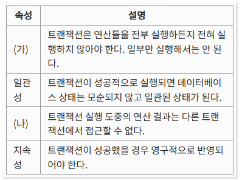
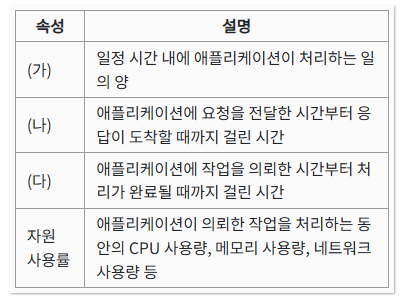
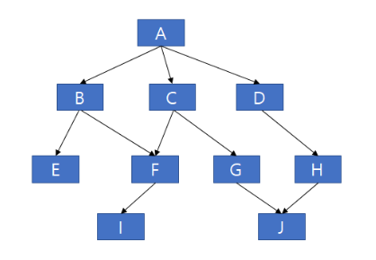

# 정보처리기사 실기 2020년 1회

## 1. 다음 ( ) 안에 들어갈 단어를 쓰시오.

( )은(는) 웹브라우저 간 HTML 문법이 호환되지 않는 문제와 SGML의 복잡함을 해결하기 위하여 개발된 다목적 마크업 언어이다.

<details>
<summary>정답</summary>
<div>

**_XML_**

</div>
</details>

<br />

## 2. 다음 ( ) 안에 들어갈 단어를 쓰시오.

( )은 속성-값 쌍(attribute-value pairs)으로 이루어진 데이터 오브젝트를 전달하기 위해 사용하는 개방형 표준 포맷이다. AJAX에서 많이 사용되고 XML을 대체하는 주요 데이터 포맷이다. 언어 독립형 데이터 포맷으로 다양한 프로그래밍 언어에서 사용되고 있다.​

<details>
<summary>정답</summary>
<div>

**_JSON_**

</div>
</details>

<details>
<summary>1-2 정리</summary>
<div markdown='1'>
애플리케이션 영역에서 데이터 포맷을 인터페이스 대상으로 전송하고, 이를 수신 측에서 <b style='color:green'>파싱</b> 후 해석하는 방식
<br />
<br />

- <b>XML</b> (eXtensible Markup Language) : HTML 문법의 비호환성과 SGML의 복잡성 해결

- <b>JSON</b> (JavaScript Object Notation) : <b style='text-decoration:underline'>속성-값 쌍</b>으로 이뤄진 데이터 오브젝트를 전달하기 위해 사용하는 개방형 표준 포맷
  <br />
  -> AJAX에서 많이 사용 / XML을 대체하는 주요 데이터 포맷

</div>
</details>
</br>

## 3. 다음은 릴리즈 노트의 구성 항목에 관한 설명이다. 설명하는 항목은 무엇인가?

릴리즈 노트 이름, 소프트웨어 이름, 릴리즈 버전, 릴리즈 날짜, 릴리즈 노트 날짜, 릴리즈 노트 버전 등의 기존정보가 포함된다.

<details>
<summary>정답</summary>
<div>

**_릴리즈 노트의 헤더(Header) 정보_**

</div>
</details>

<details>
<summary>정리</summary>
<div markdown='1'>
<b>릴리즈 노트</b> (Release Note) : 소프트웨어 또는 서비스가 출시 또는 업데이트 될 때마다 해당 상품의 배포와 함께 변경사항, 기능 추가/삭제, 버그 개선 등 변경 사항을 체계적으로 정리하여 정보를 제공하는 문서

<br />

릴리즈 노트의 헤더 정보는 기본적이고 필수적인 식별 요소들을 포함한다.

- <b>릴리즈 노트 이름</b>: 노트의 고유 식별자
- <b>소프트웨어 이름</b>: 해당 릴리즈가 적용되는 소프트웨어의 명칭
- <b>릴리즈 버전</b>: 업데이트된 소프트웨어의 버전 번호
- <b>릴리즈 날짜</b>: 소프트웨어 버전이 공식적으로 릴리즈된 날짜
- <b>릴리즈 노트 날짜</b>: 릴리즈 노트 자체가 작성되거나 마지막으로 업데이트된 날짜
- <b>릴리즈 노트 버전</b>: 릴리즈 노트의 버전 관리 정보
</div>
</details>
</br>

## 4. 애플리케이션 테스트의 기본 원리 중 살충제 패러독스(Pesticide Paradox)의 의미를 설명하시오.

<details>
<summary>정답</summary>
<div>

**_같은 테스트 케이스를 가지고, 테스트를 계속해서 반복하는 경우 어느 시점부터는 더 이상 결함을 발견하지 못한다._**

</div>
</details>

<details>
<summary>정리</summary>
<div markdown='1'>
<br />
<b>테스팅의 7가지 기본 원리</b>

1. <b>테스팅은 결함이 존재함을 밝히는 활동이다</b>: 테스트는 결함이 있음을 보여주는 것이지, 결함이 없음을 증명하는 것이 아니다.

2. <b>완벽한 테스팅은 불가능하다</b>: 모든 가능한 경우를 테스트하는 것은 현실적으로 불가능하므로, 위험 분석과 우선순위에 따라 테스트 대상을 선정하고 집중해야 합니다.

3. <b>개발 초기에 테스트를 시작한다</b>: 테스트를 개발 초기부터 시작하면 결함을 조기에 발견하고 수정하여 비용을 절감할 수 있다.

4. <b>결함 집중</b>: 일부 모듈에 대부분의 결함이 집중되는 경향이 있다. 따라서 결함이 집중될 것으로 예상되는 부분에 테스트를 집중해야 한다.

5. <b>살충제 패러독스</b>: 동일한 테스트 케이스로 동일한 테스트를 반복하면 더 이상 새로운 결함을 발견할 수 없게 된다. 따라서 테스트 케이스를 주기적으로 검토하고 수정해야한다.

6. <b>테스팅은 정황에 의존적이다</b>: 테스트 방법은 테스트 대상의 특성, 산업, 적용 분야 등 다양한 상황에 따라 달라져야 한다.

7. <b>오류 부재의 궤변</b>: 프로그램에 오류가 없더라도, 사용자의 요구사항을 만족하지 못하면 좋은 프로그램이 아니다.
</div>
</details>
</br>

## 5. 데이터 마이닝이란 무엇인지 설명하시오.

<details>
<summary>정답</summary>
<div>

**_대량의 데이터에서 통계, 기계 학습 등 다양한 기법을 활용하여 의미 있는 패턴과 유용한 정보를 추출하는 과정._**

</div>
</details>

<details>
<summary>정리</summary>
<div markdown='1'>
<b>데이터 마이닝 절차</b>

목적 설정 -> 데이터 준비 -> 가공 -> 마이닝 기법 적용 -> 정보 검증

<b>데이터 마이닝 주요 기법</b>

- <b>분류 규칙</b>: 과거 데이터를 토대로 새로운 레코드의 결과 값을 예측하는 기법
- <b>연과 규칙</b>: 데이터 안에 항목들 간의 종속관계를 찾아내는 기법
- <b>연속 규칙</b>: 연관 규칙에 시간 관련 정보가 포함된 형태의 기법
- <b>데이터 군집화</b>: 대상 레코드들을 유사한 특성을 지닌 몇 개의 소그룹으로 분할하는 작업
</div>
</details>
</br>

## 6. 프로토콜을 구성하는 대표적인 세가지 요소를 적으시오.

<details>
<summary>정답</summary>
<div>

**_구문/의미/타이밍_**

</div>
</details>

<details>
<summary>정리</summary>
<div markdown='1'>

- <b>구문(Syntax)</b>: 프로토콜에서 사용하는 메시지의 형식과 구조를 정의
- <b>의미(Semantics)</b>: 프로토콜에서 사용하는 메시지의 의미와 해석을 정의
- <b>타이밍(Timing)</b>: 프로토콜에서 사용하는 메시지의 전송 시점과 순서를 정의
</div>
</details>
</br>

## 7. 다음에서 설명하는 해시 함수는?

128비트 암호화 해시 함수로 RFC 1321로 지정되어 있으며, 주로 프로그램이나 파일이 원본 그대로인지를 확인하는 무결성 검사 등에 사용된다. 1991년에 로널드 라이베스트(Ronald Rivest)가 예전에 쓰이던 MD4를 대체하기 위해 고안하였다.

<details>
<summary>정답</summary>
<div>

**_MD5_**

</div>
</details>

<details>
<summary>정리</summary>
<div markdown='1'>

<b>해시 함수</b>

다양한 크기를 갖는 임의의 데이터로부터 <b>고정된 길이</b>의 짧은 해쉬 값을 출력하는 수학적 함수

<b>1. 암호학적 해시 함수</b>

데이터의 무결성 검증, 비밀번호 보관, 디지털 서명 등 보안 용도로 사용

- <b>MD5(Message Digest Algorithm 5)</b>: 프로그램이나 파일의 무결성 검사 등에 사용되는 128비트 함수다. 이전에 쓰이던 MD4를 대체하기 위해 고안하였다.
- <b>SHA(Secure Hash Algorithm)</b>: MD5에서 발전, 서로 연관된 해쉬 함수들의 집합, 미국 국가 표준으로 지정되었다. SHA-0과 SHA-1은 160비트의 해쉬값 크기를 가지고, <b>SHA-2(SHA-224/256/384/512)</b>는 각각 224/256/384/512 비트의 해쉬값을 제공한다.

<b>2. 비암호학적 해시 함수</b>

데이터의 오류 검출 및 빠른 검색 등 비보안 용도로 사용

- <b>CRC32</b>: 주로 데이터 전송 시 오류를 검출하는데 사용
- <b>MurmurHash</b>: 빠른 속도로 데이터를 처리해야 하는 경우에 사용

</div>
</details>
</br>

## 8. 비선점형 스케줄링 HRN의 우선순위 계산식을 작성하시오.​

<details>
<summary>정답</summary>
<div>

**_(대기시간 + 실행시간) / 실행시간_**

</div>
</details>

<details>
<summary>정리</summary>
<div markdown='1'>

스케줄링은 운영체제가 여러 프로세스 입력이 들어왔을 때 <b>프로세스 실행 우선순위</b>를 정하기 위한 기법이다.

<b>선점 스케줄링</b> (Preemptive Scheduling): CPU 사용 중인 프로세스를 강제로 중단하고, 다른 프로세스에게 배정할 수 있는 방식이다.

- <b>SRT</b> (Shortest Remaining Time): 실행 중인 프로세스의 남은 실행 기간이 더 긴 경우, <b style="text-decoration:underline">남은 실행 시간이 더 짧은 프로세스</b>가 도착하면 실행 중인 프로세스를 중단하고, 새로운 프로세스를 실행한다.

- <b>RR</b> (Round Robin): 모든 프로세스에 <b style="text-decoration:underline">동일한 시긴 할당량</b>을 주고, 해당 시간동안만 실행한 후 다음 프로세스로 전환한다. 주기적으로 모든 프로세스에게 CPU가 돌아가도록 설계된 방식이다.

- <b>MFQ</b> (Multi-Level Feedback Queue): 프로세스들이 여러 레벨의 우선순위 큐에 배정되며, 각 프로세스가 CPU를 사용할 때마다 우선순위가 변동한다. 처음엔 높은 우선순위 큐에 있다가, 시간이 지나면 낮은 우선순위 큐로 이동할 수 있다.

<b>비선점 스케줄링</b> (Non-preemptive Scheduling): 프로세스가 CPU를 점유하면 작업이 끝날 때까지 다른 프로세스가 CPU를 가로채지 않는 방식이다.

- <b>FCFS</b> (First Come First Served): 가장 <b style="text-decoration:underline">먼저 도착한 프로세스</b>부터 차례대로 CPU를 할당받아 실행한다. 먼저 도착한 긴 작업 떄문에 뒤에 도착한 짧은 작업들이 오랜 시간 대기해야하는 <b style="color:green">대기 시간 증가</b> 문제를 겪을 수 있다.

- <b>SJF</b> (Shortest Job First): CPU 사용 시간이 가장 짧은 프로세스부터 우선적으로 실행하는 방식이다. 실행 시간이 긴 프로세스가 무한정 대기하는 <b style="color:green">기아 현상</b>이 발생할 수 있다.

- <b>HRN</b> (Highest Response Ratio Next): 대기 시간과 실행 시간을 고려해 응답 비율이 높은 프로세스를 우선 처리하는 방식이다. 응답 비율은 <b style="text-decoration:underline">(대기시간 + 실행시간) / 실행시간</b>으로 계산된다.

</div>
</details>
</br>

## 9. 아래는 데이터베이스 트랜잭션의 4가지 속성이다. (가) , (나)에 들어가 단어를 적으시오.



<details>
<summary>정답</summary>
<div>

**_(가): 원자성 (나): 독립성_**

</div>
</details>

<details>
<summary>정리</summary>
<div markdown='1'>

<b>트랜잭션</b>(Transaction): 데이터베이스 상태를 변환시키는 하나의 논리적 기능을 수행하기 위한 작업 단위

> 컴퓨터 과학 분야에서의 트랜잭션(Transaction)은 <span style="color:green">"더 이상 분할이 불가능한 업무처리의 단위"</span>를 의미한다.

- <b>원자성</b> (Atomicity): 트랜잭션 연산이 정상적으로 수행되거나 <b>(Commit)</b>, 아니면 어떠한 연산도 수행되지 않아야 한다 <b>(Rollback)</b>

- <b>일관성</b> (Consistency): 시스템의 고정 요소는 트랜잭션 수행 전/후로 동일해야 한다

- <b>독립성</b> (Isolation): 개별 트랜잭션은 다른 트랜잭션의 간섭 및 영향 받지 않아야 한다

- <b>영속성</b> (Durability): 완료된 트랜잭션 결과는 영구적으로 기록되어야 한다

</div>
</details>
</br>

## 10. 다음에서 설명하는 서비스 거부 공격은?

패킷의 출발지 주소(Address)나 포트(port)를 임의로 변경하여 출발지와 목적지 주소(또는 포트)를 동일하게 함으로써, 공격 대상 컴퓨터의 실행 속도를 느리게 하거나 동작을 마비시켜 서비스 거부 상태에 빠지도록 하는 공격

<details>
<summary>정답</summary>
<div>

**_LAND Attack(Local Area Network Denial Attack)_**

</div>
</details>

<details>
<summary>정리</summary>
<div markdown='1'>

<b>서비스 공격 유형</b>

- <b>서비스 거부 공격</b> (DOS: Denial of Service): <b style="text-decoration:underline">대량의 데이터를 한 곳의 서버에 집중적으로 전송</b>하여 표적이 되는 서버의 정상적인 기능을 방해
- <b>분산 서비스 거부 공격</b> (DDOS): <b style="text-decoration:underline">여러 대의 장비에서 한 곳의 서버</b>에 분산 서비스 공격
- <b>Ping of Death</b>: Ping 명령을 전송할 때 <b style="text-decoration:color">허용범위 이상의 ICMP 패킷</b>을 전송하여 대상 시스템의 네트워크를 마비
- <b>Ping Flood</b>: 과도한 ICMP 메시지에 의한 응답 과다로 시스템 에러 유발
- <b>스머핑</b> (Smurfing): <b style="text-decoration:underline">IP / ICMP 특성</b>을 악용하여 엄청난 양의 데이터를 한 사이트에 집중적으로 보내 네트워크를 불능 상태로 만듬
- <b>TearDrop</b>: <b style="text-decoration:underline">Fragment number 값을 변형</b>하여 수신측에서 패킷 조립 시 오류로 인한 과부하로 시스템 다운을 유도
- <b>LAND Attack</b>: <b style="text-decoration:underline">송/수신 IP 주소를 모두 타겟 IP 주소로 하여</b> 자기 자신에게 무한히 응답하게 하는 공격
- <b>Evil twin attack</b>: <b style="text-decoration:underline">무선 핫스팟 네트워크에 연결된 사용자들</b>의 정보를 탈취하는 무선 wifi 피싱 기법
- <b>Switching Jamming</b>: 위조된 매체 접근 제어(MAC) 주소를 지속적으로 보내 스위치 MAC 주소를 혼란시켜 더미 허브 (Dummy Hub)처럼 작동

</div>
</details>
</br>

## 11. OSI 7계층 중 다음에서 설명하는 계층은?

전송에 필요한 두 장치 간의 실제 접속과 절단 등 기계적, 전기적, 기능적, 절차적 특성에 대한 규칙을 정의한다. 단위(PDU)는 '비트'를 사용한다.

<details>
<summary>정답</summary>
<div>

**_물리 계층_**

</div>
</details>

<details>
<summary>정리</summary>
<div markdown='1'>

<b>OSI 참조 모델</b>

1. <b>물리 계층</b> (Physical Layer)

   - 물리적 매체를 통해 0과 1의 비트 흐름을 전송하기 위해 요구되는 기능들을 조정한다.
   - <b>장비</b>: 케이블, 리피터, 허브
   - 케이블 같은 연결 장치를 사용하여 다른 장치와의 물리적인 연결을 수행하고, 이 연결을 바탕으로 전기 신호를 직접 전송하는 계층이다.

2. <b>데이터 링크 계층</b> (Data Link Layer)

   - 데이터 통신 과정에서 오류가 없도록 <b style="text-decoration:underline">노드 대 노드 간</b> 정보 전송의 신뢰성을 보장한다.
   - <b>장비</b>: 브릿지, 스위치
   - <b>주요 프로토콜</b>: CSMA/CD, LLC, Token Ring 등
   - <b>데이터 전송 단위</b>: 프레임(Frame)
   - 3계층에서 전달받은 데이터에 그 정보의 주소와 제어 정보를 각각 헤더와 테일로 붙인다. 같은 네트워크 내에서 오류 없는 프레임을 전달한다.

3. <b>네트워크 계층</b> (Network Layer)

   - 다중 네트워크 링크에서 패킷을 발신지로부터 목적지까지 성공적으로, 효과적으로 전달한다.
   - <b>장비</b>: 라우터
   - <b>주요 프로토콜</b>: IP, ICMP, IGMP, ARP 등
   - <b>데이터 전송 단위</b>: 패킷(Packet)
   - 데이터가 최종 목적지까지 <b style="text-decoration:underline">어떤 경로를 통해 전달될 지 경로를 설정</b>하는 역할을 한다.

4. <b>전송 계층</b> (Transport Layer)

   - 종단 간 정보 전송의 신뢰성을 보장하고, 오류를 복구하며, 흐름을 제어한다.
   - <b>장비</b>: 게이트웨이
   - <b>주요 프로토콜</b>: TCP, UDP 등
   - <b>데이터 전송 단위</b>: 세그먼트(Segment), 데이터그램(Datagram)
   - 데이터가 정상적으로 전송됐는지 확인하고 정상적으로 전송되지 못한 데이터가 있다면 이를 재전송하여 누락되는 데이터가 없도록 보장한다.

5. <b>세션 계층</b> (Session Layer)

   - 응용 프로세스를 통해 통신 세션을 구성한다.
   - <b>주요 프로토콜</b>: TLS, SSH
   - 애플리케이션 간의 통신을 위한 세션을 설정, 관리, 해제하는 역할을 한다.

6. <b>표현 계층</b> (Presentation Layer)

   - 운영체제를 통해 입출력되는 데이터를 다른 표현 형태로 변환한다.
   - <b>주요 프로토콜</b>: JPEG, MPEG, ASCII
   - 다른 장치에서도 내가 보낸 데이터가 내가 보낸대로 일관되게 출력되도록 하기 위한 계층이다.

7. <b>응용 계층</b> (Application Layer)
   - 사용자와 직접 상호작용하며 인터페이스 역할을 수행한다. 각 프로세스 간의 정보 교환을 담당한다.
   - <b>주요 프로토콜</b>: DHCP, DNS, FTP, HTTP
   - 우리들이 사용하는 대부분의 프로그램들이 있는 계층이다.

</div>
</details>
</br>

## 12. LoC 기법으로 개발을 해야 하는 프로젝트의 총 라인이 30000 라인이고, 개발자가 5명, 그리고 인당 월평균 300라인의 개발이 가능할 때, 개발하는데 소요될 것으로 예상되는 시간의 계산식과 그 결과를 작성하시오.

<details>
<summary>정답</summary>
<div>

**_[계산식: (30000/5) / 300] [결과: 20개월]_**

</div>
</details>

<details>
<summary>정리</summary>
<div markdown='1'>

<b>LOC 기법</b>: 원시 코드 라인 수(Line Of Code)를 기준으로 소프트웨어 개발 비용을 산정하는 상향식 비용 산정 기법이다.

30000 라인을 5명의 개발자가 나눠서 개발할 경우, <b style="text-decoration:underline">30000/5=6000</b>로 각각 6000라인을 작업하게 된다. 인당 월평균 300라인의 개발이 가능하기 떄문에 <b style="text-decoration:underline">6000/300=20</b> 즉 20개월의 개발 기간이 소요된다.

</div>
</details>
</br>

## 13. 아래는 애플리케이션 성능을 측정하기 위한 요소들이다. (가), (나),(다)에 들어갈 단어를 적으시오.



<details>
<summary>정답</summary>
<div>

**_[계산식: (30000/5) / 300] [결과: 20개월]_**

</div>
</details>

</br>

## 14. 다음은 소프트웨어 모듈화에 관한 설명이다. (가), (나)에 들어갈 단어를 각각 적으시오.

모듈의 기능적 독립성은 소프트웨어를 구성하는 각 모듈의 기능이 서로 독립됨을 의미하는 것으로, 모듈이 하나의 기능만을 수행하고 다른 모듈과의 과도한 상호작용을 배제함으로써 이루어진다. 모듈의 독립성을 높이기 위해서는 ( 가 )는 약하게, ( 나 )는 강하게 만들어야 한다.

<details>
<summary>정답</summary>
<div>

**_(가)결합도 (나)응집도_**

</div>
</details>

<details>
<summary>정리</summary>
<div markdown='1'>

<b>모듈화</b>는 소프트웨어를 더 작은 부분으로 나누어 구조화하는 것을 말한다. 모듈의 독립성을 높이기 위해서는 결합도는 약하게, 응집도는 강하게 만들어야 한다.

<b>결합도</b>는 모듈의 상호작용이나 의존성을 의미하며, 약한 결합도로 인해 모듈 간의 연결이 느슨해져서 적절하게 분리될 수 있다.

<b>응집도</b>는 모듈 내부의 요소들이 관련되어 있는 정도를 나타내며, 강한 응집도로 인해 모듈 내부의 요소들이 잘 정리되고 관련성이 높아져 모듈의 안정성과 명확성이 올라간다.

</div>
</details>
</br>

## 15. 데이터베이스 성능 개선과 관련하여 '데이터베이스 반정규화'란 무엇인지 설명하시오.

<details>
<summary>정답</summary>
<div>

**_시스템 성능 향상, 개발 및 운영 편의성 등을 위해 정규화된 데이터 모델을 통합, 중복, 분리하는 과정으로 의도적으로 정규화 원칙을 위배하는 것_**

</div>
</details>

<details>
<summary>정리</summary>
<div markdown='1'>

<b>정규화</b>: 데이터베이스를 데이터의 일관성, 최소환의 데이터 중복, 최대한의 데이터 유연성을 위해 구조화하는 방법

<b>반정규화</b>: 의도적으로 정규화 원칙을 위배하는 행위

</div>
</details>
</br>

## 16. 다음의 시스템 구조도에서 팬인(Fan-in)이 2 이상인 것은?



<details>
<summary>정답</summary>
<div>

**_F, J_**

</div>
</details>

<details>
<summary>정리</summary>
<div markdown='1'>

<b>팬인</b>(Fan-In): 하나의 게이트가 여러 입력을 받을 수 있는 최대 개수

<b>팬아웃</b>(Fan-Out): 하나의 출력이 다른 회로나 게이트에 얼마나 많이 연결될 수 있는지

</div>
</details>
</br>

## 17. 다음은 C언어로 작성된 코드이다. 코드의 실행 결과를 쓰시오. (단, 출력문의 출력 서식을 준수하시오.)

```
#include
void align(int a[ ]) {
int temp;
for (int i = 0; i < 4; i++) {
  for (int j=0; j < 4 - i; j++)  {
    if (a[j]> a[j+1]) {
      temp = a[j];
      a[j] = a[j+1];
      a[j+1] = temp;
    }
  }
}

main( ) {
    int a[ ] = { 85, 75, 50, 100, 95 };
    align(a);
     for (int i = 0; i < 5; i++) printf("%d ", a[i]);
}
```

<details>
<summary>정답</summary>
<div>

**_50 75 85 95 100_**

</div>
</details>

<details>
<summary>정리</summary>
<div markdown='1'>

1. 정수 배열 `a`를 인자로 받는 `align`함수를 호출
2. 정수 변수 `temp`를 선언
3. 이중 반복문에서 정수 배열의 붙어있는 원소를 교환
4. 숫자가 더 클 경우에 배열의 뒤로 보냄
5. 출력: `50 75 85 95 100`

</div>
</details>
</br>

## 18. 다음은 C언어로 작성된 코드이다. 코드의 실행 결과를 쓰시오. (단, 출력문의 출력 서식을 준수하시오.)

```
#include
main( ) {
   int c = 1;
   switch (3) {
      case 1: c += 3;
      case 2: c++;
      case 3: c = 0;
      case 4: c += 3;
      case 5: c -= 10;
      default: c--;
   }
   printf("%d", c);
}
```

<details>
<summary>정답</summary>
<div>

**_-8_**

</div>
</details>

<details>
<summary>정리</summary>
<div markdown='1'>

1. 정수 `c`를 1로 초기화
2. switch문의 값이 3이기 때문에, `case 3`을 실행
3. c = 0으로 초기화 (break가 없으므로 default까지 반복)
4. c += 3 (c = 3)
5. c -= 10 (c = -7)
6. c-- (c = -8)
7. 출력: `-8`

</div>
</details>
</br>

## 19. 다음은 Java언어로 작성된 코드이다. 코드의 실행 결과를 쓰시오. (단, 출력문의 출력 서식을 준수하시오.)

```
public class Test {
   static int[ ] arr( ) {
     int a[ ] = new int[4];
     int b = a.length;
     for(int i = 0; i < b; i++)
        a[i] = i;
     return a;
  }

  public static void main(String[ ] args) {
     int a[ ] = arr( );
     for(int i = 0; i < a.length; i++)
        System.out.print(a[i] + " ");
  }
}
```

<details>
<summary>정답</summary>
<div>

**_0 1 2 3_**

</div>
</details>

<details>
<summary>정리</summary>
<div markdown='1'>

1. `arr`메소드를 호출
2. 길이가 4인 정수 배열 `a`를 선언
3. 정수 변수 b에 `a`의 길이(4)를 초기화
4. 0부터 3까지 반복하며 `a`에 값을 할당 (0, 1, 2, 3)
5. 배열 `a`를 반환
6. 출력: `0 1 2 3`

</div>
</details>
</br>

## 20. 학생 테이블에 전기과 학생이 50명, 전산과 학생이 100명, 전자과 학생이 50명 있다고 할 때, 다음 SQL문 ①, ②, ③의 실행 결과로 표시되는 튜플의 수를 쓰시오. (단, DEPT 필드는 학과를 의미)​

```
1) SELECT 학과 FROM 학생;
2) SELECT DISTINCT 학과 FROM 학생;
3) SELECT COUNT(DISTINCT 학과) FROM 학생 WHERE 학과='전산과';
```

<details>
<summary>정답</summary>
<div>

**_1)200 2)3 3)1_**

</div>
</details>

<details>
<summary>정리</summary>
<div markdown='1'>

1. 모든 학생의 학과를 출력하므로 총 학생 수인 200개의 튜플이 나옴
2. 모든 학생의 학과 중 중복을 제외하고 출력하므로 `전기,전산,전자` 3개의 튜플이 나옴
3. 학과가 전산과인 학생(100)의 중복을 제외한 학과에 개수를 출력하므로 `전산` 1개의 튜플이 나옴

</div>
</details>
</br>
