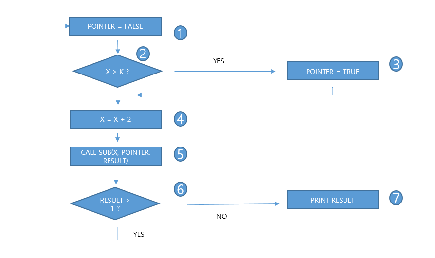
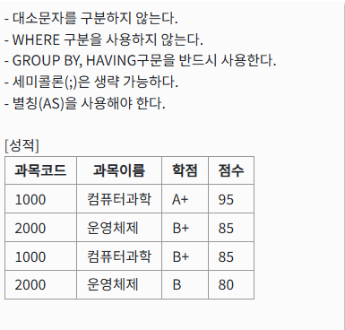

# 정보처리기사 실기 2020년 3회

## 1. 리팩토링의 목적에 대한 설명을 작성하시오.

<details>
<summary>정답</summary>

**_코드의 외부 동작을 변경하지 않고 내부 구조를 개선하여 가독성, 유지보수성, 안정성을 높이는 것_**

</details>

<details>
<summary>정리</summary>
<div markdown="1">

- <b>가독성 향상</b>: 코드를 이해하기 쉽게 만들어 다른 개발자나 미래의 자신이 코드를 더 빨리 이해하도록 돕는다.
- <b>유지보수 용이성</b>: 코드가 명확하고 잘 정리되어 있어 버그를 찾고 수정하는 과정이 훨씬 수월해집니다.
- <b>코드 품질 개선</b>: 불필요한 중복 코드를 제거하고, 구조를 개선하여 전반적인 소프트웨어의 품질을 높입니다.
- <b>수정 비용 절감</b>: 코드를 수정해야 할 때, 구조가 잘 잡혀 있으면 작업 시간이 단축되어 비용을 절감할 수 있습니다.
- <b>확장성 확보</b>: 미래의 요구사항에 맞춰 소프트웨어를 확장하기 용이한 구조로 만듭니다.

</div>

</details>

## 2. 다음의 출력 결과를 쓰시오.

```java
#include <stdio.h>
void main() {
    int c=0;
    int i=0;
        while(i<10) {
    	i++;
        c *= i;
    }
    printf("%d", c);
}
```

<details>
<summary>정답</summary>

**_0_**

</details>

<details>
<summary>정리</summary>
<div markdown="1">

1. <b>int c=0</b>: 정수 변수 `c`를 0으로 초기화
2. <b>int i=0</b>: 정수 변수 `i`를 0으로 초기화
3. <b>while(i<10)</b>: `i`가 0 미만이 아닐 때까지 반복
4. <b>i++</b>: 반복할 때마다 1씩 증가하기 때문에, i가 10이 될때까지 증가
5. <b>c \*= i</b>: c는 0으로 초기화되었기 때문에, i를 계속해서 곱해도 계속 0을 유지한다.
6. <b>출력</b>: 0

</div>

</details>

## 3. 대표적인 내부 라우팅 프로토콜로 다익스트라 알고리즘을 이용한 대규모 네트워크에 적합한 링크 상태 라우팅 프로토콜로 불리는 라우팅 프로토콜은 무엇인가?

<details>
<summary>정답</summary>

**_OSPF(Open Shortest Path First)_**

</details>

## 4. TCP/IP에서 신뢰성없는 IP를 대신하여 송신측으로 네트워크의 IP 상태 및 에러 메시지를 전달해주는 프로토콜을 ( )이라 한다.

<details>
<summary>정답</summary>

**_ICMP_**

</details>

<details>
<summary>정리</summary>
<div markdown="1">

<b>ICMP(Internet Control Message Protocol)</b>: 인터넷 프로토콜의 비신뢰적인 특성을 보안하기 위한 프로토콜로 IP 패킷 전송 중 에러 발생 시 원인을 알려주거나 네트워크 상태를 진단해주는 기능을 제공

<b>Ping of Death</b>: Ping 명령을 전송할 때 <b style="text-decoration:underline">허용범위 이상의 ICMP 패킷</b>을 전송하여 대상 시스템의 네트워크를 마비

</div>

</details>

## 5. 다음의 출력 결과를 쓰시오.

```java
public class Test{
    public static void main(String []args){
        int i=0;
        int sum=0;
        while (i<10){
            i++;
            if(i%2==1)
              continue;
        sum += i;
        }
    System.out.print(sum);
    }
}
```

<details>
<summary>정답</summary>

**_30_**

</details>

<details>
<summary>정리</summary>
<div markdown="1">

1. <b>int i=0</b>: 정수 변수 `i`를 0으로 초기화
2. <b>int sum=0</b>: 정수 변수 `sum`을 0으로 초기화
3. <b>while (i<10)</b>: `i`가 10 미만이 아닐 때까지 반복
4. <b>i++</b>: `i`가 0부터 10이 될 때까지 반복해서 증가
5. <b>if(i%2==1) continue</b>: i가 짝수일 경우만, 다음 코드 실행
6. <b>sum += i</b>: 짝수를 계속해서 더함 (2+4+6+8+10 = 30)
7. <b>출력</b>: 30

</div>

</details>

## 6. 심리학자 톰 마릴은 컴퓨터가 메시지를 전달하고 메시지가 제대로 도착했는지 확인하며 도착하지 않았을 경우 메시지를 재전송하는 일련의 방법을 '기술적 은어'를 뜻하는 ( )이라는 용어로 정의하였다. ( )안에 들어갈 용어는?

<details>
<summary>정답</summary>

**_프로토콜_**

</details>

## 7. 다음 아래 제어 흐름 그래프가 분기 커버리지를 만족하기 위한 테스팅 순서를 쓰시오.



<details>
<summary>정답</summary>

**_1234561, 124567_**

</details>

<details>
<summary>정리</summary>
<div markdown="1">

<b>코드 커버리지</b>(Code Coverage): 테스트가 소프트웨어를 충분히 검증할 수 있는지 나타내는 지표이다.

<b>측정 기준</b>

- <b>함수 커버리지</b>: 전체 함수 중 몇 개의 함수가 호출되었는지 측정

  - 함수 커버리지 = (실행된 함수의 수 / 전체 함수의 수) \* 100

- <b>구문 커버리지</b>: 전체 구문 중 몇 줄의 구문이 실행되었는지 측정

  - 구문 커버리지 = (실행된 구문의 수 / 전체 구문의 수) \* 100

- <b>결정(분기) 커버리지</b>: 조건문의 분기가 모두 실행되었는 지를 기준으로 한다. 전체 조건문이 각각 한번씩 실행되면 충족된다.

  - 여러 조건문을 논리 연산자로 연결 했을 때 각각의 조건의 결과가 아니라 최종적으로 도출되는 결과를 기준으로 한다.
  - ex) 조건문이 `x > 0 && y < 0` 일 때 전체 조건문이 True/False인 경우만 확인

- <b>조건 커버리지</b>: 결정 커버리지와 다르게 개별 조건식을 기준으로 한다.

  - ex) 조건문이 `x > 0 && y < 0` 이라면 `x > 0`이 True/False 일 때, `y < 0`이 True/False일 때를 각각 확인

- <b>조건/결정 커버리지</b>: 전체 조건문과 개별 조건문의 True/False를 모두 확인하는 것을 말한다.

</div>

</details>

## 8. 다음 조건을 만족하면서, 과목별 점수의 평균이 90이 상인 과목이름, 최소점수, 최대점수를 구하는 SQL문을 작성하시오.



<details>
<summary>정답</summary>

**_SELECT 과목이름, MIN(점수) AS 최소점수, MAX(점수) AS 최대점수 FROM 성적 GROUP BY 과목이름 HAVING AVG(점수)>=90_**

</details>

<details>
<summary>정리</summary>
<div markdown="1">

<b>GROUP BY</b>: 특정 컬럼을 기준으로 그룹화
<b>HAVING</b>: `GROUP BY` 절에서 조건을 줄 때 사용
<b>ORDER BY</b>: 특정 컬럼을 오름차순/내림차순으로 정렬

<b>수행 순서</b>

1. FROM
2. WHERE
3. GROUP BY
4. HAVING
5. SELECT
6. ORDER BY
7. LIMIT

</div>

</details>

## 9. 학생 테이블에서 이름이 민수인 튜플을 삭제하는 SQL문을 작성하시오

<details>
<summary>정답</summary>

**_DELETE FROM 학생 WHERE 이름='민수'_**

</details>

<details>
<summary>정리</summary>
<div markdown="1">

```sql
DELETE FROM [테이블명] WHERE [필드명] = [값]
```

<b>데이터 조작어</b>(DML: Data Manipulation Language)

- <b>SELECT</b>(검색): SELECT `FROM` 테이블명 [WHERE 조건];
- <b>INSERT</b>(삽입): INSERT `INTO` 테이블명 VALUES 데이터;
- <b>DELETE</b>(삭제): DELETE `FROM` 테이블명 [WHERE 조건];
- <b>UPDATE</b>(변경): UPDATE 테이블명 SET 속성명 = 데이터 [WHERE 조건];

</div>

</details>

## 10. 릴레이션 A, B가 있을 때 릴레이션 B 조건에 맞는 것들만 릴레이션 A에서 튜플을 꺼내 프로젝션하는 관계대수의 기호는 무엇인가?

<details>
<summary>정답</summary>

**_÷_**

</details>

<details>
<summary>정리</summary>
<div markdown="1">

<b>관계 대수</b>: 원하는 정보의 검색 과정을 정의하는 절차적 언어

<b>8대 연산자</b>

- <b>σ Select</b>(선택): 조건을 만족하는 튜플들의 부분 집합 (수평 연산)
- <b>ㅠ Project</b>(추출): 속성들의 부분 집합, 중복 제거 (수직 연산)
- <b>∪ Union</b>(합집합): 두 릴레이션의 튜플들을 합침, 중복 제거
- <b>∩ Intersection</b>(교집합): 두 릴레이션의 중복되는 값만 추출
- <b>- Difference</b>(차집합): 두 릴레이션의 튜플들의 겹치지 않는 부분만을 도출
- <b>x Carteslan Product</b>(교차곱): 두 릴레이션의 가능한 모든 튜플의 집합, 컬럼끼리 더하기 / 튜플끼리 곱하기
- <b>÷ Division</b>(나누기): 한 테이블에서 다른 테이블의 모든 값을 가지고 있는 행들을 추출, A의 속성이 B의 속성 값을 모두 가진 튜플에서 B가 가진 속성을 제외한 나머지 속성들만 추출
- <b>⋈ Join</b>(조인): 두 개의 릴레이션을 하나로 합쳐 새로운 릴레이션 형성
  - <b>세타 조인</b>: 두 릴레이션에서 공통된 속성을 기준으로 비교 연산자를 사용하여 조건을 만족하는 튜플들을 결합하는 것이다.
  - <b>동등 조인</b>: 세타 조인 중에서 비교 연산자가 `=`인 조인이다.
  - <b>자연 조인</b>: 동등 조인의 결과 릴레이션에서 조인 애트리뷰트를 제외한 조인 (중복 필드 제거)

[https://inpa.tistory.com/entry/DB-%F0%9F%93%9A-%EA%B4%80%EA%B3%84-%EB%8C%80%EC%88%98-%EA%B4%80%EA%B3%84-%ED%95%B4%EC%84%9D-SQL-%F0%9F%95%B5%EF%B8%8F-%EC%A0%95%EB%A6%AC]

</div>

</details>

## 11. 다음 중 헝가리안 표기법(Hungarian Notation)에 대해서 서술하시오.

<details>
<summary>정답</summary>

**_식별자 표기 시 접두어에 자료형을 붙이는 표기법_**

</details>

<details>
<summary>정리</summary>
<div markdown="1">

- <b>카멜 표기법</b>(Camel Case): 첫 글자를 대문자로 적되, 맨 앞에 오는 글자는 소문자로 표기
  - `int totalNumber`
- <b>파스칼 표기법</b>(Pascal Case): 카멜 표기법과 거의 흡하사하지만 맨 앞에 오는 글자도 대문자로 표기
  - `int TotalNmuber`
- <b>헝가리안 표기법</b>(Hungarian Notation): 접두어에 자료형을 알아볼 수 있게끔 표기하는 것이다.
  - `String strName`
- <b>스네이크 표기법</b>(Snake Case): 단어 사이에 언더바를 넣어서 표기
  - `int total_number`

</div>

</details>

## 12. 테스트의 종류 중, 동치 분할 테스트, 경계값 분석 테스트 등의 종류가 있는 테스트 기법을 쓰시오.

<details>
<summary>정답</summary>

**_블랙박스 테스트_**

</details>

<details>
<summary>정리</summary>
<div markdown="1">

<b>블랙박스 테스트</b>: 프로그램 내부 구조나 작동 원리를 알지 못한 채로, 입력값을 넣어 올바른 출력값이 나오는지 확인하는 방식이다.

- <b>종류: 동치 분할 테스트 / 경계값 분석 / 원인-효과 그래프 검사 / 비교 검사 / 오류 예측 검사</b>

</div>

</details>

## 13. 다음은 C언어 소스 코드이다. 출력 결과를 쓰시오.

```c
#include <studio.h>
int r1(){
	return 4;
}
int r10(){
	return (30+r1());
}
int r100(){
	return (200+r10());
}
int main(){
	printf("%dn", r100());
    return 0;
}
```

<details>
<summary>정답</summary>

**_234_**

</details>

<details>
<summary>정리</summary>
<div markdown="1">

1. `r100` 함수를 호출
2. `r10` 함수를 호출하고 그 값에 `200`을 더함
3. `r1` 함수를 호출하고 그 값에 `30`을 더함
4. `r1` 함수는 4를 반환
5. 4 + 30 + 200 = 234
6. <b>출력</b>: 234

</div>

</details>

## 14. 데이터베이스에서 스키마(Schema)에 대해 간략히 설명하시오.

<details>
<summary>정답</summary>

**_데이터베이스의 전체적인 구조와 제약조건에 대한 명세로, 내부 스키마와 개념 스키마, 외부 스키마로 나뉜다_**

</details>

## 15. 다음은 자바(Java) 코드이다. 출력 결과를 쓰시오.

```java
abstract class vehicle{
    private String name;
    abstract public String getName(String val);
    public String getName(){
    	return "vehicle name:" + name;
    }
	public void setName(String val){
    	name = val;
    }
}

class Car extends Vehicle{
	public Car(String val){
    	setName(val);
   }
public String getName(String val){
	return "Car name : " + val;
   }
public String getName(byte val[]){
	return "Car name : " + val;
   }
}

public class good {
	public Static void main(String[] args){
    Vehicle obj = new Car("Spark");
    System.out.print(obj.getName());
    }
}
```

<details>
<summary>정답</summary>

**_a_**

</details>

<details>
<summary>정리</summary>
<div markdown="1">

1. <b>new Car("Spark")</b>: `Car` 클래스 호출
2. <b>setName(val)</b>: `Car` 클래스의 생성자 함수에서 부모 클래스의 `setName` 메서드를 호출
3. <b>name = val</b>: 부모 클래스 `Vehicle`의 변수 `name`에 "Spark"를 할당
4. <b>Obj.getName()</b>: 오버라이딩을 통해 매개변수가 없는 `Vehicle`의 `getName()` 메서드를 호출
5. <b>출력</b>: `vehicle name:Spark`

</div>

</details>

## 16. UI 설계 원칙 중 직관성에 대해 설명하시오.

<details>
<summary>정답</summary>

**_누구나 쉽게 이해하고, 쉽게 사용할 수 있어야 한다는 원칙_**

</details>

## 17. 형상 통제를 설명하시오.

<details>
<summary>정답</summary>

**_형상 항목의 버전 관리를 위해서 변경 여부와 변경 활동을 통제하는 활동_**

</details>

<details>
<summary>정리</summary>
<div markdown="1">

</div>

</details>

## 18. EAI 유형에는 메세지 버스(Message bus) 유형, 하이브리드(Hybrid) 유형, ( A ) 유형, ( B ) 유형이 있다. 괄호안에 들어갈 말을 적으시오.

<details>
<summary>정답</summary>

**_A.포인트 투 포인트(Point-to-point) B.허브 앤 스포크(Hub & Spoke)_**

</details>

<details>
<summary>정리</summary>
<div markdown="1">

<b>EAI(Enterprise Application Integration)</b>: 기업에서 사용되는 다양한 애플리케이션 간의 데이터와 기능을 통합하는 기술이다. 서로 다른 시스템이 데이터를 실시간으로 주고받을 수 있게 해주어, 기업 내 정보와 프로세스를 원활하게 연결할 수 있도록 한다.

- <b>Point-to-Point</b>: 각 애플리케이션이 <b style="text-decoration:underline">직접 연결</b>되는 방식으로, 중간에 별도의 미들웨어를 두지 않음

- <b>Hub & Spoke</b>: <b style="text-decoration:underline">중앙에 허브 시스템</b>을 두고, 모든 애플리케이션이 이 허브를 통해 데이터를 전송하는 방식

- <b>Message Bus(ESB)</b>: 애플리케이션들 사이에 <b style="text-decoration:underline">ESB(Enterprise Service Bus)라는 미들웨어</b>를 두고 데이터를 주고 받음. 각 시스템은 어댑터를 통해 버스와 연결됨

- <b>Hybrid</b>: 위의 방식들을 조합하여 상황에 맞게 <b style="text-decoration:underline">유연</b>하게 구축하는 방식

</div>

</details>

## 19. C++에서 생성자란 무엇인지 쓰시오

<details>
<summary>정답</summary>

**_해당 클래스의 객체가 생성될 때 자동으로 호출되는 특수한 종류의 메서드_**

</details>

## 20. 학생 테이블에 주소 속성을 추가하는 SQL문을 작성하려고 한다. 빈 칸을 채우시오.

```sql
(    A    ) TABLE 학생   (   B   ) 주소 VARCHAR(20);
```

<details>
<summary>정답</summary>

**_A. ALTER B. ADD_**

</details>

<details>
<summary>정리</summary>
<div markdown="1">

<b>ALTER TABLE</b>: 테이블에 새로운 속성을 추가할 때 사용

- `ADD COLUMN` or `ADD` 뒤에 속성명과 속성의 타입까지 정의

</div>

</details>
