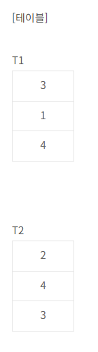
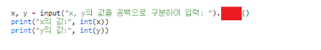
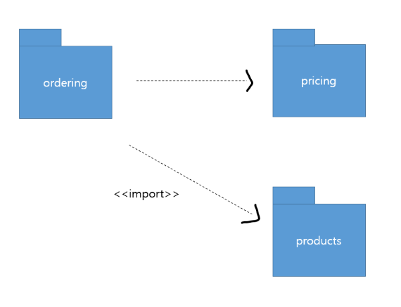
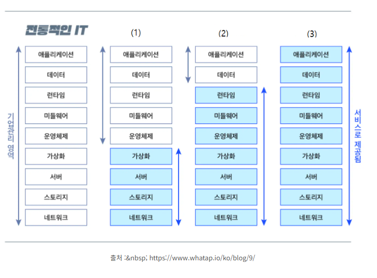

# 정보처리기사 실기 2023년 3회

## 1. 다음은 Java 코드로 작성한 프로그램이다. 올바른 출력 결과를 작성하시오.

```java
public class main{
    public static void main(String[] args) {
        A b = new B();
        b.paint();
        b.draw();
    }
}

class A {
    public void paint() {
        System.out.print("A");
        draw();
    }
    public void draw() {
        System.out.print("B");
        draw();
    }
}

class B extends A {
    public void paint() {
        super.draw();
        System.out.print("C");
        this.draw();
    }
    public void draw() {
        System.out.print("D");
    }
}
```

<details>
<summary>정답</summary>

**_a_**

</details>

<details>
<summary>정리</summary>
<div markdown="1">

1. `A b = new B()`: `A` 클래스로 업캐스팅하며 `B` 인스턴스를 생성
2. `b.paint()`: 오버라이딩으로 `B` 클래스의 `paint` 메서드 호출
   - `super.draw()`: 부모 클래스 `A`의 `draw` 메서드 호출
     - `System.out.print("B")`: B를 출력
     - `draw()`: 오버라이딩을 통해 `B` 클래스의 `draw` 메서드 호출
     - `System.out.print("D")`: D를 출력
   - `System.out.print("C")`: `C`를 출력
   - `this.draw()`: `B` 클래스의 `draw` 메서드 호출
3. ` b.draw()`: 오버라이딩으로 `B` 클래스의 `draw` 메서드 호출
4. <b>출력</b>: BDCDD

</div>

</details>

## 2. 다음 설명하는 용어를 보기에 맞게 골라 '기호'를 작성하시오.

[보기]
ㄱ.NFT ㄴ.JWT  
ㄷ.SAML ㄹ.accessToken  
ㅁ.SSO ㅂ.OIDC  
ㅅ.Autentication ㅇ. OAuth  
ㅈ.Cookie ㅊ.Refresh Token

---

- 사용자가 사용자 이름 및 암호와 같은 자격 증명을 공유하지 않고도 타사 애플리케이션이 데이터 또는 리소스에 액세스할 수 있도록 권한을 부여할 수 있는 개방형 표준 프로토콜이다.

- 사용자가 데이터에 대한 제어를 유지하면서 리소스에 대한 액세스 권한을 부여할 수 있는 안전하고 표준화된 방법을 제공하며, 액세스 토큰을 사용하여 타사 애플리케이션에 리소스에 대한 액세스 권한을 부여하는 메커니즘을 사용자에게 제공하는 방식으로 작동한다.

- 사용자가 응용 프로그램에 대한 액세스 권한을 부여하면 응용 프로그램은 사용자를 대신하여 사용자의 리소스 또는 데이터에 액세스하는 데 사용할 수 있는 액세스 토큰을 받는다.

- 암호와 같은 사용자의 자격 증명은 타사 응용 프로그램과 공유되지 않으며, 클라우드 스토리지 서비스, 온라인 마켓 플레이스 및 금융 서비스를 포함한 다른 많은 응용 프로그램 및 서비스에서도 사용된다.

- Facebook, Twitter 및 LinkedIn과 같은 소셜 미디어 플랫폼에서 널리 사용되어 사용자가 소셜 미디어 데이터에 대한 액세스 권한을 타사 애플리케이션에 부여할 수 있도록 한다.

- 타사 애플리케이션에 대한 사용자 자격 증명의 노출을 최소화하여 향상된 보안, 간소화된 애플리케이션 개발, 사용자가 리소스에 대한 액세스 권한을 쉽게 부여하거나 취소할 수 있도록 하여 향상된 사용자 환경 등 여러 가지 이점을 제공한다.

<details>
<summary>정답</summary>

**_OAuth_**

</details>

<details>
<summary>정리</summary>
<div markdown="1">

- <b>NFT(Non-fungible token)</b>: <b style="text-decoration:underline">블록체인 기술</b>을 이용해서 디지털 자산의 소유주를 증명하는 가상의 토큰
- <b>JWT(JSON Web token)</b>: <b style="text-decoration:underline">인증 정보를 JSON 형태로 암호화</b>하여 토큰으로 만든 다음, 해당 토큰을 클라이언트에게 전달하는 방식
- <b>SAML(Security Assertion Markup Language)</b>: 사용자 인증 정보를 <b style="text-decoration:underline">ID 공급자(IdP)와 서비스 공급자(SP) 간에 교환</b>하기 위한 XML 기반의 개방형 표준
- <b>Access Token</b>: 사용자나 컴퓨터 프로그램이 <b style="text-decoration:underline">접근할 권리를 증명하는데 사용되는 문자열</b>이며, 일반적으로 인터넷에서 사용자 인증 및 권한 부여를 위해 주로 사용된다.
- <b>Refresh Token</b>: Access Token과 함께 발급되는 별도의 토큰으로, <b style="text-decoration:underline">새로운 Access Token을 재발급하기 위해 사용되는 토큰</b>이다.
- <b>SSO(Single Sign-On)</b>: <b style="text-decoration:underline">한 번의 로그인</b>으로 여러 애플리케이션이나 시스템에 접근할 수 있게 해주는 인증 방식
- <b>OIDC(OpenID Connect)</b>: 사용자가 보호된 HTTPS 엔드포인트엔 엑세스하려고 할 때 사용자의 신원을 확인하는 인증 프로토콜이다. <b style="text-decoration:underline">OAuth를 기반으로</b> 하며 인증에 사용된다.
- <b>Cookie</b>: 웹 사이트가 <b style="text-decoration:underline">사용자의 개인장치에 저장하는 작은 텍스트 파일</b>

</div>

</details>

## 3. 리눅스(Linux)에서 사용자에게 읽기/쓰기/실행 권한을 부여하고, 그룹에게는 읽기/실행을 부여하고, 그 이외에는 실행 권한을 test.txt 파일에 부여하는 위한 명령어는 다음과 같다. 빈칸에 들어갈 답을 작성하시오. (8진법 사용)

<details>
<summary>정답</summary>

**_1)chmod 2)751_**

</details>

<details>
<summary>정리</summary>
<div markdown="1">

읽기(4), 쓰기(2), 실행(1)

- 사용자: 4 + 2 + 1 = 7
- 그룹: 4 + 1 = 5
- 그 외: 1

- chmod 751 test.txt

</div>

</details>

## 4. 다음은 C 언어 코드이다. 알맞는 출력 결과를 작성하시오.

```c
#include <stdio.h>

int test(int n) {
    int i, sum = 0;

    for (i = 1; i <= n / 2; i++){
        if (n % i == 0)
        sum += i;
    }

    if (n == sum)
        return 1;
    ​
    return 0;
}

int main(){
    int i, sum=0;

    for (i = 2; i <= 100; i++){
        if (test(i))
        sum += i;
    }

    printf("%d ", sum);
    return 0;
}
```

<details>
<summary>정답</summary>

**_34_**

</details>

<details>
<summary>정리</summary>
<div markdown="1">

1. `for (i = 2; i <= 100; i++)`: 2부터 100까지 반복
   - `if (test(i))`: `test` 메서드를 실행하고 반환값에 따라 조건 일치/불일치 확인
2. `test(int n)`
   - `for (i = 1; i <= n / 2; i++)`: 1부터 n/2 까지 반복
   - `if (n % i == 0)`: i로 나누었을 때 0이 되면 일치
   - `sum += i`: 위에 조건을 만족하면 `sum`에 더함
   - `if (n == sum)`: 약수의 합이 숫자와 일치하면 1을 반환, 아니면 0을 반환
   - 즉 2부터 100까지 반복하며 "약수의 합이 숫자와 일치하는 수" 완전수의 갯수를 찾음
   - 6 + 28 = 34
3. <b>출력</b>: 34

</div>

</details>

## 5. C언어에서 구조체의 멤버에 접근하기 위해 괄호안의 기호를 작성하시오.

```c
#include <stdio.h>
#include <stdlib.h>

typedef struct Data{
    char c;
    int *numPtr;
} Data;

int main(){
    int num = 10;
    Data d1;
    Data *d2 = malloc(sizeof(struct Data));

    d1.numPtr = &num;
   d2 ( ) numPtr = &num;

    printf("%d\n", *d1.numPtr);
    printf("%d\n", *d2 ( ) numPtr);

    free(d2);
    return 0;
}
```

<details>
<summary>정답</summary>

**_->_**

</details>

<details>
<summary>정리</summary>
<div markdown="1">

1. `Data d1`: 구조체 `Data` 타입의 변수 `d1`을 선언
2. `Data *d2 = malloc(sizeof(struct Data))`: 구조체 `Data` 타입의 포인터 변수 `d2`를 초기화
3. `d1.numPtr = &num`: 변수 `d1.numPtr`에 `10` 값을 할당
4. `d2->numPtr = &num`: `d2.numPtr`에 `10`을 할당
5. <b>출력</b>: 10 10

</div>

</details>

## 6. 다음 빈칸에 들어갈 UNION 연산의 결과값을 작성하시오.



```sql
[쿼리]
SELECT A FROM  T1
UNION
SELECT A FROM  T2
ORDER BY A DESC;
```

<details>
<summary>정답</summary>

**_4321_**

</details>

<details>
<summary>정리</summary>
<div markdown="1">

1. `SELECT A FROM  T1`: `T1` 테이블의 `A` 속성과
2. `SELECT A FROM  T2`: `T2` 테이블의 `A` 속성의
3. `UNION`: 합집합을 구함
   - 3 1 4 2
4. `ORDER BY A DESC`: 결과값을 내림차순으로 정렬
   - 4 3 2 1
5. <b>출력</b>: 4321

</div>

</details>

## 7. 다음 설명은 서버 접근 통제의 유형이다. 괄호 안에 들어갈 용어를 작성하시오. ('영어 약자'로 작성하시오.)

- ( ① )은/는 규칙 기반(Rule-Based) 접근통제 정책으로, 객체에 포함된 정보의 허용 등급과 접근 정보에 대하여 주체가 갖는 접근 허가 권한에 근거하여 객체에 대한 접근을 제한하는 방법이다.

- ( ② )은/는 중앙 관리자가 사용자와 시스템의 상호관계를 통제하며 조직 내 맡은 역할(Role)에 기초하여 자원에 대한 접근을 제한하는 방법이다.

- ( ③ )은/는 신분 기반(Identity-Based) 접근통제 정책으로, 주체나 그룹의 신분에 근거하여 객체에 대한 접근을 제한하는 방법이다.

<details>
<summary>정답</summary>

**_1) MAC 2)RBAC 3)DAC_**

</details>

<details>
<summary>정리</summary>
<div markdown="1">

- <b>MAC(Mandatory Access Control, 강제 접근 통제)</b>: <b style="text-decoration:underline">규칙 기반(Rule-Based) 접근 통제</b> 정책으로, 주체(사용자)와 객체(자원) 모두에게 <b style="text-decoration:underline">보안 등급</b>이 부여되고, 이를 바탕으로 접근을 제한하는 방식
- <b>RBAC(Role-Based Access Control, 역할 기반 접근 통제)</b>: <b style="text-decoration:underline">역할(Role)</b>에 따라 접근 권한을 부여하는 방식으로, <b style="text-decoration:underline">중앙 관리자</b>가 사용자에게 역할을 할당하고, 그 역할에 기반해 자원 접근을 제어한다.
- <b>DAC(Discretionary Access Control, 임시 접근 통제)</b>: <b style="text-decoration:underline">신분 기반(Identity-Based)</b> 접근 통제 정책으로, 자원 소유자가 자신의 신분에 따라 자원에 대한 접근 권한을 자유롭게 설정할 수 있는 방식이다.

</div>

</details>

## 8. 다음 C언어 코드에 알맞는 출력값을 작성하시오.

```c
#include

int f(int n) {
    if(n<=1) return 1;
    else return n*f(n-1);
}

int main() {
    printf("%d", f(7));
}
```

<details>
<summary>정답</summary>

**_5040_**

</details>

<details>
<summary>정리</summary>
<div markdown="1">

1. `f()` 함수 호출
   - `if(n<=1) return 1`: 들어온 매개변수가 1보다 작거나 같으면 1을 반환
   - `else return n*f(n-1)`: 아닐 경우, 재귀함수로 `n-1` 값을 호출하고 `n`과 곱함
   - 즉, 들어온 숫자부터 1까지 순회하면 곱하는 재귀함수다.
2. `f(7)`
   - 7*6*5*4*3*2*1 = 42*20*6 = 840\*6 = 5040
3. <b>출력</b>: 5040

</div>

</details>

## 9. 다음 설명에 대해 괄호 안에 알맞는 용어를 작성하시오. (영어 약자로 작성하시오.)

- ( )은/는 자료를 일정한 크기로 정하여 순서대로 전송하는 자료의 전송 방식이다.

- 셀이라 부르는 고정 길이 패킷을 이용하여 처리가 단순하고 고속망에 적합하며, 연속적으로 셀을 보낼 때
  다중화를 하지 않고 셀단위로 동기가 이루어지지만 경우에 따라 동기식 시간 분할 다중화를 사용하기도 한다.

- 가상 채널 (Virtual Channel) 기반의 연결 지향 서비스로 셀이라 부르는 고정 길이(53바이트) 패킷을 사용하며 통계적 다중화 방식을 이용한다.

<details>
<summary>정답</summary>

**_ATM(Asynchronous Transfer Mode)_**

</details>

## 10. 다음은 C언어의 포인터 문제이다. 알맞는 출력값을 작성하시오.

```c
#include

int main() {
    char* p = "KOREA";
    printf("%s\n", p);
    printf("%s\n", p+1);
    printf("%c\n", *p);
    printf("%c\n", *(p+3));
    printf("%c\n", *p+4);
}
```

<details>
<summary>정답</summary>

**_a_**

</details>

<details>
<summary>정리</summary>
<div markdown="1">

1. `char* p = "KOREA"`: 문자열 포인터 변수 `p`를 "KOREA"로 초기화
2. `%s`는 문자열을 가리키며 포인터 변수(char \*)를 입력으로 받고, `null`을 만날때까지 출력한다.
   - `p`: KOREA
   - `p+1`: OREA
3. `%c`는 문자를 가리키며 문자 변수(char)를 입력으로 받고, 해당 문자를 출력한다.
   - `*p`: K
   - `*(p+3)`: E
   - `*p+4`: 'K' + 4 = O
4. <b>출력</b>:

   KOREA

   OREA

   K

   E

   O

</div>

</details>
 
## 11. 다음은 Java 코드에 대한 알맞는 출력값을 작성하시오.

```java
class Parent {
    int compute(int num) {
        if(num <= 1)
            return num;
        return compute(num-1) + compute(num-2);
    }
}

class Child extends Parent {
    int compute(int num) {
        if(num <= 1)
            return num;
        return compute(num-1) + compute(num-3);
    }
}

public class main {
    public static void main(String args[]) {
        Parent obj = new Child();
        System.out.print(obj.compute(7));
    }
}
```

<details>
<summary>정답</summary>

**_2_**

</details>

<details>
<summary>정리</summary>
<div markdown="1">

1. `Parent obj = new Child()`: `Child` 인스턴스를 `Parent` 클래스 업캐스팅해서 생성
2. `obj.compute(7)`: 오버라이딩을 통해 `Child`의 `compute` 메서드가 호출
   - `if(num <= 1) return num`: `num`이 1 이하라면 `num`을 반환
   - `return compute(num-1) + compute(num-3)`: `Child` 내의 메서드이기 때문에, 계속해서 재귀호출된다.
3. `obj.compute(7)`
   - `compute(2)` = compute(1) + compute(-1) = 1 + (-1) = 0
   - `compute(3)` = compute(2) + compute(0) = 0
   - `compute(4)` = compute(3) + compute(1) = 1
   - `compute(5)` = compute(4) + compute(2) = 1
   - `compute(6)` = compute(5) + compute(3) = 1
   - `compute(7)` = compute(6) + compute(4) = 1 + 1 = 2

</div>

</details>

## 12. IP 패킷에서 외부의 공인 IP주소와 포트 주소에 해당하는 내부 IP주소를 재기록하여 라우터를 통해 네트워크 트래픽을 주고받는 기술은 무엇인가?

<details>
<summary>정답</summary>

**_NAT(Network Address Translation)_**

</details>

<details>
<summary>정리</summary>
<div markdown="1">

</div>

</details>

## 13. 다음 자바 코드를 실행할 경우 에러가 발생이 된다. 에러가 발생하는 라인명을 작성하시오.

```java
class Person {
    private String name;
    public Person(String val) {
        name = val;
    }
    public static String get() {
    return name;
    }
    public void print() {
        System.out.println(name);
    }
}
public class main {
    public static void main(String[] args) {
        Person obj = new Person("Kim");
        obj.print();
    }
}
```

<details>
<summary>정답</summary>

**_7_**

</details>

<details>
<summary>정리</summary>
<div markdown="1">

```java
public static String get() {
    return name;
}
```

`get`은 `static`으로 선언된 정적 메서드인데, 개인 인스턴스 변수인 `name`에 접근하려하기 때문에 오류가 발생한다.

</div>

</details>

## 14. 다음은 Python 프로그램에 대한 문제이다. 빨간색 박스로 가려진 '예약어' 를 알맞게 작성하시오. (단, 첫 번째 라인의 '5 10'은 사용자로 부터 입력받은 값에 해당한다.)



#실행결과

x, y의 값을 공백으로 구분하여 입력: 5 10
x의 값: 5
y의 값: 10

<details>
<summary>정답</summary>

**_split_**

</details>

<details>
<summary>정리</summary>
<div markdown="1">

문자를 분리하는 메서드: `split`

</div>

</details>

## 15. 다음은 판매와 관련된 다이어그램이다. 해당 다이어그램의 명칭을 쓰시오.



<details>
<summary>정답</summary>

**_패키지 다이어그램_**

</details>

<details>
<summary>정리</summary>
<div markdown="1">

- <b>구조적 다이어그램(Structure Diagrams)</b>
  1. <b>클래스 다이어그램(Class)</b>: 클래스의 이름, 속성, 메서드를 정리한 다이어그램
  2. <b>객체 다이어그램(Object)</b>: 클래스에 속한 사물(객체), 즉 인스턴스를 특정 시점의 객체와 객체 사이의 관계로 표현
  3. <b>컴포넌트 다이어그램(Component)</b>: 컴포넌트들이 더 큰 구조를 만들기 위해 어떻게 연결되는지, 복잡한 시스템 구조를 설명하기 위해 사용
  4. <b>배치 다이어그램(Deployment)</b>: 컴포넌트 사이의 종속성을 표현하며 결과물, 프로세스, 컴포넌트 등 물리적 요소들의 위치를 표현
  5. <b>복합체 구조 다이어그램(Composite Structure)</b>: 클래스나 컴포넌트가 복합 구조를 갖는 경우 그 내부 구조를 표현
  6. <b>패키지 다이어그램(Package)</b>: 유스케이스나 클래스 등의 모델 요소들을 그룹화한 패키지들의 관계를 표현한다.
- <b>행위적 다이어그램(Behavioral Diagrams)</b>
  1. <b>유스케이스 다이어그램(Usecase)</b>: 시스템의 기능적 요구 정의에 활용하며 사용자 관점에서 시스템의 활동을 표현
  2. <b>시퀀스 다이어그램(Sequence)</b>: 객체 간 상호 작용을 메시지 흐름으로 표현하여 시간을 표현할 수 있다.
  3. <b>커뮤니케이션 다이어그램(Communication)</b>: 시퀀스 다이어그램과 같이 동작에 참여하는 객체들이 주고받는 메시지를 표현하는 데 메시지뿐만 아니라 객체 간의 연관까지 표현할 수 있다
  4. <b>상태 다이어그램(State)</b>: 하나의 객체가 신이 속한 클래스의 상태 변화 혹은 다른 객체와의 상호 작용에 따라 상태가 어떻게 변화는지 표현
  5. <b>활동 다이어그램(Activity)</b>: 시스템이 어떤 기능을 수행하는지를 객체의 처리 로직이나 조건에 따른 처리의 흐름으로 순서대로 표현

</div>

</details>

## 16. 다음 설명에 알맞는 답을 보기에서 골라 '기호' 를 작성하시오.

- 시스템이나 시스템 구성요소(component) 또는 소프트웨어 프로그램의 입력값과 출력값이 특정 그룹으로 분류되며, 분류된 그룹내의 값들이 시스템에 의해 동일하게 취급된다는 특성을 이용하여 시험하는 기법

- 유사한 입력값들이 시스템을 거치면서 유사한 답변이 나온다는 것을 가정하여 테스트

- 하나의 값은 그 분할 내 모든 값을 대표하는 것으로 간주하는 기법

- 모든 입력값을 시험할 필요가 없게 하여 시험을 효율적으로 수행하도록 지원

- 일반적으로 경계값 분석기법(boundary value analysis)과 함께 테스트 케이스 도출하는데 사용

보기

ㄱ.Equivalence Partitioning ㄴ.Statement Coverage ㄷ.Boundary Value Analy ㄹ.Branch Coverage
ㅁ.Error Guessing ㅂ.Condition Coverage ㅅ.Cause Effect Graph

<details>
<summary>정답</summary>

**_ㄱ.Equivalence Partitioning_**

</details>

<details>
<summary>정리</summary>
<div markdown="1">

<b>등가 분할 테스트(Equivalence Partitioning)</b>: 시스템이나 시스템 구성요소 또는 소프트웨어 프로그램이 입력값과 출력값이 특정 그룹으로 분류되며, <b style="text-decoration:underline">분류된 그룹내의 값들이 시스템에 의해 동일하게 취급된다는 특성</b>을 이용하여 시험하느 기법

</div>

</details>

## 17. 다음은 클라우드에 대한 유형 문제이다. 괄호안에 알맞는 답을 보기에 골라 작성하시오.



보기

PaaS SaaS IaaS

<details>
<summary>정답</summary>

**_1) IaaS 2) PaaS 3) SaaS_**

</details>

<details>
<summary>정리</summary>
<div markdown="1">

- <b>IaaS(Infrastructure as a Service)</b>: 서버, 스토리지 등 하드웨어의 기본적인 IT 자원만 제공되기 때문에 사용자는 운영체제부터 미들웨어, 런타임, 그리고 데이터 등을 직접 구성하고 관리할 수 있다.
- <b>PaaS(Platform as a Service)</b>: 소프트웨어를 개발할 수 있는 플랫폼까지 제공하는 서비스이다. IaaS에 운영체제, 미들웨어, 런타임이 추가된 형태이며 개념의 범위가 가장 넓다.
- <b>SaaS(Software as a Service)</b>: 클라우드 기반의 소프트웨어 자체를 서비스로 제공하는 형태이다. 일반적인 사용자들이 가장 많이 접하게 되는 클라우드 서비스이다.

</div>

</details>

## 18. 다음은 프로토콜 종류에 관한 설명이다. 알맞는 답을 작성하시오.

- 최소 Hop count를 파악하여 라우팅하는 프로토콜이다.

- 거리와 방향으로 길을 찾아가는 Distance Vector 다이나믹 프로토콜이다.

- 최단거리 즉, Hop count가 적은 경로를 택하여 라우팅하는 프로토콜로 Routing Table에 인접 라우터 정보를 저장하여 경로를 결정한다.

- 최대 Hop count는 15로 거리가 짧기 때문에 IGP로 많이 이용하는 프로토콜이다.

<details>
<summary>정답</summary>

**_RIP_**

</details>

## 19. 다음은 관계 대수에 대한 내용이다. 보기에 알맞는 기호를 작성하시오.

1. join : ( 1 )
2. project : ( 2 )
3. select : ( 3 )
4. division : ( 4 )

보기

ㄱ. σ ㄴ. π ㄷ.⋈ ㄹ.÷

<details>
<summary>정답</summary>

**_1) ㄷ 2) ㄴ 3) ㄱ, 4) ㄹ_**

</details>

## 20. 다음은 데이터베이스에 관련된 문제이다. 괄호 안에 알맞는 답을 작성하시오.

( ) 무결성은 관계 데이터베이스 관계 모델에서 2개의 관련 있던 관계 변수(테이블) 간의 일관성(데이터 무결성)을 말한다.

종종 기본 키 또는 키가 아닌 후보 키와 외래 키의 조합으로 강제 적용된다.

외래 키가 선언된 관계 변수의 외래 키를 구성하는 속성(열)의 값은 그 관계 변수의 부모가 되는 관계 변수의 기본 키 값 또는 기본 키가 아닌 후보 키 값으로 존재해야 한다.

<details>
<summary>정답</summary>

**_참조_**

(개체, 도메인, 참조)

</details>
