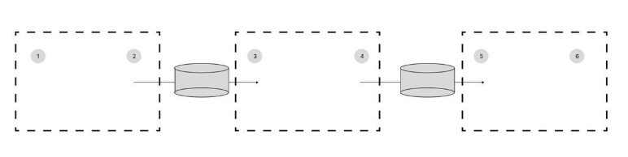
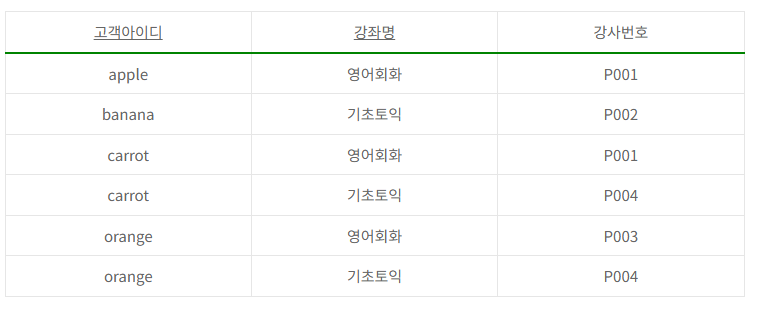
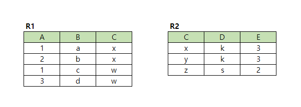

# 정보처리기사 실기 2024년 1회

## 1. 다음 Java 코드에서 알맞는 출력 값을 작성하시오.

```java
class Connection {
    private static Connection _inst = null;
    private int count = 0;

    static public Connection get() {
        if(_inst == null) {
            _inst = new Connection();
            return _inst;
        }
        return _inst;
    }

    public void count() {
         count++;
    }

    public int getCount() {
         return count;
    }
}

public class main {
    public static void main(String[] args) {

        Connection conn1 = Connection.get();
        conn1.count();

        Connection conn2 = Connection.get();
        conn2.count();

        Connection conn3 = Connection.get();
        conn3.count();

        conn1.count();
        System.out.print(conn1.getCount());
    }

}
```

<details>
<summary>정답</summary>

**_4_**

</details>

<details>
<summary>정리</summary>
<div markdown="1">

1. `Connection.get()`: 클래스 `Connection`의 정적 메서드 `get`을 호출
   - 정적 변수 `_inst`의 값이 null이라면
   - `_inst = new Connection()` 인스턴스를 생성
   - 그리고 해당 인스턴스를 반환
2. `conn1.count()`: count에 1을 더함 (0+1=1)
3. `conn2.count()`: 싱글톤 패턴이기 때문에 같은 인스턴스를 공유 (1+1=2)
4. `conn3.count(); conn1.count()`: (2+1+1=4)
5. `conn1.getCount()`: `count`의 값을 반환 (4)
6. <b>출력</b>: 4

</div>

</details>

## 2. 다음 C언어 코드에서 알맞는 출력 값을 작성하시오.

```c
#include <stdio.h>
int main() {
    int v1 = 0, v2 = 35, v3 = 29;

    if(v1 > v2 ? v2 : v1) {
        v2 = v2 << 2;
    }else{
        v3 = v3 << 2;
    }

    printf("%d", v2+v3);
}
```

<details>
<summary>정답</summary>

**_151_**

</details>

<details>
<summary>정리</summary>
<div markdown="1">

1. `int v1 = 0, v2 = 35, v3 = 29` 정수 변수 초기화
2. `if(v1 > v2 ? v2 : v1)`: `v1`이 `v2`보다 크면 `v2`를 반환, 아니라면 `v1`을 반환
   - 0 > 35 이기 때문에 `v1` 0을 반환
   - 조건문이 `false`이기 때문에 `else`문을 실행
   - `v3 = v3 << 2`: `29 << 2 = 11101 << 2`는 1110100이 되고, `v3`는 64+32+16+4=116
   - 35 + 116 = 151
3. <b>출력</b>: 151

</div>

</details>

## 3. 다음은 응집도와 관련해서 보기에서 응집도가 높은 순으로 나열하시오.

보기

ㄱ. 기능 ㄴ. 교환 ㄷ. 우연 ㄹ. 시간

<details>
<summary>정답</summary>

**_ㄱ. 기능 ㄴ. 교환 ㄹ. 시간 ㄷ. 우연_**

</details>

## 4. 다음은 C언어에 대한 문제이다. 알맞는 출력 값을 작성하시오.

```c
#include <stdio.h>
#include <string.h>

void reverse(char* str){
    int len = strlen(str);
    char temp;
    char*p1 = str;
    char*p2 = str + len - 1;
    while(p1<p2){
        temp = *p1;
        *p1 = *p2;
        *p2 = temp;
        p1++;
        p2--;
    }
}

int main(int argc, char* argv[]){
    char str[100] = "ABCDEFGH";

    reverse(str);

    int len = strlen(str);

    for(int i=1; i<len; i+=2){
        printf("%c",str[i]);
    }

    printf("\n");

    return 0;

}
```

<details>
<summary>정답</summary>

**_GECA_**

</details>

<details>
<summary>정리</summary>
<div markdown="1">

1. `char str[100] = "ABCDEFGH"`: 길이가 100인 문자열 배열 `str`을 초기화
2. `reverse` 함수 호출
   - `char*p1 = str`: 문자열 배열의 포인터 변수 `p1`
   - `char*p2 = str + len - 1`: 문자열 마지막 문자의 포인터 변수 `p2`
   - `while(p1<p2)`: `p1`이 `p2`보다 클 동안
     - `temp = *p1; *p1 = *p2; *p2 = temp`: `p1`의 값과 `p2`의 값을 치환
     - `p1++; p2--`: 치환한 후에 각 포인터를 높이고, 낮춤
   - `reverse(str)`: 문자열 `"ABCDEFGH"`과 뒤집어고, 주소는 `str` 배열의 뒤에 위치
3. `for(int i=1; i<len; i+=2)`: 1부터 2씩 증가하며 반복 (홀수)
4. `str[i]`: `i`는 홀수 인덱스만 가진다.
   - i = 1, 3, 5, 7
   - GECA
5. <b>출력</b>: GECA

</div>

</details>

## 5. 아래 그림에서의 네트워크에서 라우터을 통한 할당 가능한 2번, 4번, 5번의 IP를 작성하시오.



1. 192.168.35.3/24
2. 129.200.10.16/22
3. 192.168.36.24/24

<details>
<summary>정답</summary>

**_2) 192.168.35.72 4) 129.200.8.249 5) 192.168.36.249_**

</details>

<details>
<summary>정리</summary>
<div markdown="1">

- 1번(192.168.35.3/24)은 192.168.35.0/24 네트워크
- 3번(129.200.10.16/22)은 129.200.8.0/22 네트워크
- 6번(192.168.36.24/24)은 192.168.36.0/24 네트워크

같은 네트워크 내의 장비들은 IP 대역이 동일해야 한다.

- 2번은 1번(192.168.35.0)과 같은 <b style="text-decoration:underline">192.168.35.72</b>
- 4번은 3번(129.200.8.0)과 같은 <b style="text-decoration:underline">129.200.8.249</b>
- 5번은 6번(192.168.36.0)과 같은 <b style="text-decoration:underline">192.168.36.249</b>

</div>

</details>

## 6. 아래 표에서 나타나고 있는 정규형을 작성하시오.



<details>
<summary>정답</summary>

**_제 3 정규형_**

</details>

## 7. 아래의 내용에서 설명하는 네트워크 용어를 영문 약자로 작성하시오.

1. 대표적인 링크 상태 라우팅 프로토콜이다. 이것은 인터넷에서 연결된 링크의 상태를 감시하여 최적의 경로를 선택한다는것이다.

2. 단일 자율 시스템 내에서 라우팅 정보를 배포하는 데 사용되는 내부 게이트웨이 프로토콜이다.

3. 모든 대상에 도달하기 위한 최단 경로를 구축하고 계산하며 최단 경로는 Dijkstra 알고리즘을 사용하여 계산된다.

<details>
<summary>정답</summary>

**_OSPF_**

<b>키워드: 네트워크, 최단/최적 경로, 다익스트라</b>

</details>

## 8. 아래 내용의 각각의 설명에 대한 답을 작성하시오.

(1) 조인에 참여하는 두 릴레이션의 속성 값을 비교하여 조건을 만족하는 튜플만 반환한다.

(2) 조건이 정확하게 '=' 등호로 일치하는 결과를 반환한다.

(3) ( (2) ) 조인에서 조인에 참여한 속성이 두 번 나오지 않도록 중복된 속성을 제거한 결과를 반환한다.

<details>
<summary>정답</summary>

**_1) 세타조인 2) 동등조인 3) 자연조인_**

</details>

## 9. 다음은 운영체제 페이지 순서를 참고하여 할당된 프레임의 수가 3개일 때 LRU와 LFU 알고리즘의 페이지 부재 횟수를 작성하시오.

페이지 참조 순서 : 1, 2, 3, 1, 2, 4, 1, 2, 5, 7

<details>
<summary>정답</summary>

**_6,6_**

</details>

<details>
<summary>정리</summary>
<div markdown="1">

- LRU(Least Recently Used): 가장 오랫동안 사용 안한게 버려짐

  - 1 (부재 1)
  - 1 2 (부재 2)
  - 1 2 3 (부재 3)
  - 2 3 1
  - 3 1 2
  - 1 2 4 (부재 4)
  - 2 4 1
  - 4 1 2
  - 1 2 5 (부재 5)
  - 2 5 7 (부재 6)

- LFU(Least Frequently Used): 사용 빈도수가 낮은 애가 버려짐
  - 1(1) (부재 1)
  - 1(1) 2(1) (부재 2)
  - 1(1) 2(1) 3(1) (부재 3)
  - 1(2) 2(1) 3(1)
  - 1(2) 2(2) 3(1)
  - 1(2) 2(2) 4(1) (부재 4)
  - 1(3) 2(2) 4(1)
  - 1(3) 2(3) 4(1)
  - 1(3) 2(3) 5(1) (부재 5)
  - 1(3) 2(3) 7(1) (부재 6)

</div>

</details>

## 10. 아래 JAVA언어 코드의 실행 순서를 중복 번호없이 작성하시오.

```JAVA
class Parent {
    int x, y;

    Parent(int x, int y) { ①
        this.x=x;
        this y=y;
    }

    int getT() { ②
        return x*y;
    }
}

​class Child extend Parent {
    int x;

    Child (int x) { ③
        super(x+1, x);
        this.x=x;
    }

    int getT(int n){ ④
        return super.getT()+n;
    }
}

class Main {
    public static void main(String[] args) { ⑤
        Parent parent = new Child(3); ⑥
        System.out.println(parent.getT()); ⑦
    }
}
```

실행 순서 : 5 → ( ) → ( ) → ( ) → ( ) → ( )

<details>
<summary>정답</summary>

**_63172_**

</details>

<details>
<summary>정리</summary>
<div markdown="1">

1. `Parent parent = new Child(3)`: `Child` 인스턴스를 `Parent` 클래스로 업캐스팅해서 생성
2. `Child` 생성자 함수 실행
   - `super(x+1, x)`: 부모 클래스 생성자 함수 호출 (4, 3)
   - `this.x=x; this y=y`: `Parent` x = 4, y = 3
   - `this.x=x`: `Child` x = 3
3. `parent.getT()`: 매개변수가 없는 `getT` 메서드는 `Parent`에만 존재하기 때문에 이를 실행
   - `return x*y`: 4 \* 3 = 12
4. <b>출력</b>: 12

실행 순서 : 5 -> 6 -> 3 -> 1 -> 7 -> 2

</div>

</details>

## 11. 다음 C언어의 알맞는 출력값을 작성하시오.

```c
#include <stdio.h>

typedef struct{
    int accNum;
    double bal;
}BankAcc;

double sim_pow(double base, int year){
    int i;
    double r = 1.0;

    for(i=0; i<year; i++){
        r = r*base;
    }
    return r;
}

void initAcc(BankAcc *acc, int x, double y){
    acc -> accNum = x;
    acc -> bal = y;
}

void xxx(BankAcc *acc, double *en){
    if (*en > 0 && *en < acc -> bal) {
        acc -> bal = acc -> bal-*en;
    }else{
        acc -> bal = acc -> bal+*en;
    }
}

void yyy(BankAcc *acc){
    acc -> bal = acc -> bal * sim_pow((1+0.1),3);
}

int main(){

    BankAcc myAcc;
    initAcc(&myAcc, 9981, 2200.0);
    double amount = 100.0;
    xxx(&myAcc, &amount);
    yyy(&myAcc);
    printf("%d and %.2f", myAcc.accNum, myAcc.bal);
    return 0;
}
```

<details>
<summary>정답</summary>

**_9981 and 2795.10_**

</details>

<details>
<summary>정리</summary>
<div markdown="1">

1. `BankAcc myAcc` 정수와 실수를 담은 구조체로 `myAcc` 변수 초기화
2. `initAcc(&myAcc, 9981, 2200.0)` 함수 호출
   - `acc -> accNum = x`: `acc.accNum`에 `x`를 할당 (9981)
   - `acc -> bal = y`: `acc.bal`에 `y`를 할당 (2200.0)
3. `double amount = 100.0`: 실수 변수 `amount`에 100.0을 초기화
4. `xxx(&myAcc, &amount)` 함수 호출
   - `if (*en > 0 && *en < acc -> bal)`: `amount` 값이 0보다 크고, `amount`보다 `acc.bal`보다 크다면 일치 (100.0 > 0 && 100.0 < 2200.0 = true)
   - 일치하므로 `acc -> bal = acc -> bal-*en`를 실행
   - `acc.bal = 2200.0 - 100.0`: 2100.0
5. `yyy(&myAcc)` 함수 호출
   - `acc -> bal = acc -> bal * sim_pow((1+0.1),3)`: `acc.bal = acc.bal * sim_pow((1.1),3)`, `sim_pow` 함수 호출
     - `for(i=0; i<year; i++){r = r*base}`
     - 1. 1.1 \* 1.0 = 1.1
     - 2. 1.1 \* 1.1 = 1.21
     - 3. 1.21 \* 1.1 = 1.331
   - 2100.0 \* 1.331 = 2795.1
6. <b>출력</b>: 9981 and 2795.10

</div>

</details>

## 12. 다음 파이썬 코드에 대한 알맞는 출력 값을 작성하시오.

```python
a = ["Seoul", "Kyeonggi", "Incheon", "Daejun", "Daegu", "Pusan"]
str = "S"

for i in a:
    str = str + i[1]

print(str)
```

<details>
<summary>정답</summary>

**_Seynaau_**

</details>

<details>
<summary>정리</summary>
<div markdown="1">

1. `a = ["Seoul", "Kyeonggi", "Incheon", "Daejun", "Daegu", "Pusan"]`: 문자열 6개를 담은 배열 `a` 초기화
2. `str = "S"`: 문자 변수 `str`을 `"S"`로 초기화
3. `for i in a:`: 배열 `a`를 순회
   - `str = str + i[1]`: 문자열의 두번째 문자를 문자열 `str`의 뒤에 이어붙임
   - Seynaau
4. <b>출력</b>: Seynaau

</div>

</details>

## 13. 아래 보기의 SQL 문장과 테이블을 참고하여 출력 값을 표로 작성하시오.



```sql
SELECT
    B
FROM
    R1
WHERE
    C IN (SELECT C FROM R2 WHERE D="k");
```

<details>
<summary>정답</summary>

**_a_**

</details>

<details>
<summary>정리</summary>
<div markdown="1">

1. `FROM R1`: R1 테이블에서
2. `WHERE C IN (SELECT C FROM R2 WHERE D="k")`: 조건에 해당하는
   - `FROM R2`: R2 테이블에서
   - `WHERE D="k"`: D 속성의 값이 "k"인 튜플의
   - `SELECT C`: C를 조회
     - (x, y)
3. `C IN (x, y)`: C 속성의 값이 "x"나 "y" 중에 하나인
4. `SELECT`: B를 조회
5. <b>출력</b>:

   B

   a

   b

</div>

</details>

## 14. 아래는 애플리케이션 테스트 관리에 대한 내용이다. 설명하는 답을 보기에서 골라 작성하시오.

1. 모든 분기와 조건의 조합을 고려하나 모든 조합을 테스트하는 대신에 테스트가 필요한 중요한 조합을 찾아내는데에 중점을 둔다.

2. 특정 조건을 수행할 때 다른 조건과는 상관없이 전체 결과에 영향을 미치는 조건만을 테스트한다.

3. 각각의 파라미터는 적어도 한 번은 최종 결과에 영향을 주어야 한다.

<details>
<summary>정답</summary>

**_ㄹ.변경 조건/결정 커버리지_**

</details>

## 15. 다음 아래 내용을 보고 보기에서 알맞는 용어를 골라 작성하시오.

인터넷 공격자의 존재를 숨기면서 이 공격자에게 시스템에 대한 무제한 접근 권한을 부여하는 악성 프로그램이다.

해커가 자신의 존재를 숨기면서 허가되지 않은 컴퓨터나 소프트웨어에 접근할 수 있도록 설계된 도구이다.

일반적으로 펌웨어, 가상화 계층 등의 다양한 시스템 영역에서 작동하며, 운영체제의 시스템콜을 해킹하여 악성코드의 실행여부를 숨겨 안티바이러스 탐지를 우회할 수 있다.

보기
ㄱ.Worm ㄴ.Trojan horse ㄷ.Backdoor ㄹ.Virus ㅁ.Ransomware ㅂ.Spyware ㅅ.Rootkit

<details>
<summary>정답</summary>

**_ㅅ.Rootkit_**

</details>

<details>
<summary>정리</summary>
<div markdown="1">

- <b>Worm</b>: 다른 컴퓨터의 취약점을 이용하여 스스로 전파하거나 메일로 전파되며 스스로를 증식(독자적으로 실행 가능)
- <b>Trojan horse</b>: 정상적인 프로그램으로 가장하여 숨어 있는 바이러스(복제x)
- <b>Backdoor</b>: 보안이 제거된 비밀통로 무단 접근을 위한 통로
  - 탐지 방법: 무결성 검사, 로그 분석, setID파일, 열린 포트 검사
- <b>Virus</b>: 파일 메모리 영역에 자신을 복제하는 악성 프로그램(독자적으로 실행 불가)
- <b>Ransomware</b>: 내부 문서 파일 등을 암호화해 사용자가 열지 못하게 하고 이를 인질로 금전을 요구하는 악성 프로그램
- <b>Spyware</b>: 사용자의 컴퓨터로 들어가서 기기와 사용자로부터 데이터를 수집하여 동의 없이 제 3자에게 전송하는 악성 소프트웨어
- <b>Rootkit</b>: 권한이 없는 사용자가 접근할 수 없는 영역에 접근하여 시스템을 제어하도록 설계된 악성 소프트웨어

</div>

</details>

## 16. 다음 Java 코드를 보고 알맞는 출력 값을 작성하시오.

```java
class classOne {
    int a, b;

    public classOne(int a, int b) {
        this.a = a;
        this.b = b;
    }

    public void print() {
        System.out.println(a + b);
    }

}
class classTwo extends classOne {
    int po = 3;

    public classTwo(int i) {
        super(i, i+1);
    }

    public void print() {
        System.out.println(po*po);
    }
}

public class main {
    public static void main(String[] args) {
        classOne one = new classTwo(10);
        one.print();
    }
}
```

<details>
<summary>정답</summary>

**_9_**

</details>

<details>
<summary>정리</summary>
<div markdown="1">

1. `classOne one = new classTwo(10)`: `classTwo` 인스턴스를 생성하고, `classOne` 클래스로 업캐스팅
2. `classTwo` 생성자 함수 실행
   - `super(i, i+1)`: 부모 클래스 `classOne`의 생성자 함수를 실행
     - `this.a = a; this.b = b`: a = 10, b = 11
3. `one.print()`: 오버라이딩을 통해 `classTwo`의 메서드가 실행
   - po \* po = 9
4. <b>출력</b>: 9

</div>

</details>

## 17. 다음 아래 내용을 보고 보기에서 알맞는 용어를 골라 작성하시오.

1. 불특정 다수가 아닌 명확한 표적을 정하여 지속적인 정보수집 후 공격감행할 수 있다.

2. 시스템에 직접 침투하는 것뿐 아니라 표적 내부직원들이 이용하는 다양한 단말을 대상으로 한다.

3. 한가지 기술만이 아닌 Zero-day 취약점, 악성코드 등 다양한 보안 위협 공격 기술을 사용한다.

4. 일반적으로 공격은 침투, 검색, 수집 및 유출의 4단계로 실행되며, 각 단계별로 다양한 공격 기술을 사용한다.

보기
ㄱ.사회공학 기법 ㄴ.Adware ㄷ.MITM ㄹ.XDR ㅁ.Replace attack ㅂ.key logger attack ㅅ.APT

<details>
<summary>정답</summary>

**_ㅅ.APT_**

</details>

<details>
<summary>정리</summary>
<div markdown="1">

- <b>사회공학 기법</b>: 사람의 심리를 이용하여 개인 정보를 탈취하는 기법(사칭 전화, 피싱 이메일)
- <b>Adware</b>: 광고 소프트웨어로, 사용자에게 원치않는 광고를 표시하는 프로그램
- <b>MITM(Man-in-the-Middle)</b>: 중간자 공격으로, 공격자가 두 당사자 간의 통신을 가로채고 정보를 탈취하거나 조작하는 방식
- <b>XDR(Extended Detection and Response)</b>: 여러 보안 도구를 통합하여 네트워크, 엔드포인트, 클라우드, 이메일 등 다양한 환경에서 발생하는 보안 위협을 탐지하고 대응하는 보안 솔루션
- <b>Replace Attack</b>: 공격자가 원래의 데이터를 변경하여 자신이 원하는 데이터를 삽입하거나 대체하는 공격 기법
- <b>Key Logger Attack</b>: 키 입력을 기록하는 악성 소프트웨어, 사용자가 입력한 모든 키 입력을 기록해 비밀번호, 신용카드 정보 등 민감한 데이터를 탈취함
- <b>APT(Advanced Persistent Threat)</b>: 특정 공격 대상을 목표로 다양한 해킹 기술을 이용해 원하는 결과를 얻을 때까지 지속적으로 공격하는 해킹 기법

</div>

</details>

## 18. 아래의 SQL 코드와 테이블을 참고하여 결과 값을 작성하시오.


```sql
SELECT
    COUNT(*)
FROM
    TABLE
WHERE
    EMPNO > 100
AND
    SAL >= 3000 OR EMPNO = 200
```

<details>
<summary>정답</summary>

**_1_**

</details>

<details>
<summary>정리</summary>
<div markdown="1">

1. `FROM TABLE`: 테이블로부터
2. `WHERE`: 조건에 해당하는
   - `EMPNO > 100`: EMPNO 값이 100보다 큰 경우
     - [200 3000], [300 1500]
   - `SAL >= 3000 OR EMPNO = 200`: SAL 값이 3000 이상이거나 EMPNO 값이 200인 경우
     - [200 3000]
   - <b>최종</b>:200 3000
3. `SELECT COUNT(*)`: 조건에 해당하는 튜플의 개수
   - [200 3000] 1개
4. <b>출력</b>: 1
</div>

</details>

## 19. 다음 C언어 코드의 알맞는 출력 값을 작성하시오.

```c
#include<stdio.h>
#include<ctype.h>

int main(){
    char*p = "It is 8";
    char result[100];
    int i;

    for(i=0; p[i]!='\0'; i++){
        if(isupper(p[i]))
            result[i] = (p[i]-'A'+5)% 25 + 'A';
        else if(islower(p[i]))
            result[i] = (p[i]-'a'+10)% 26 + 'a';
        else if(isdigit(p[i]))
            result[i] = (p[i]-'0'+3)% 10 + '0';
        else if(!(isupper(p[i]) || islower(p[i]) || isdigit(p[i])))
            result[i] = p[i];
    }

    result[i] = '\0';
    printf("%s\n",result);

    return 0;
}
```

<details>
<summary>정답</summary>

**_a_**

</details>

<details>
<summary>정리</summary>
<div markdown="1">

1. `char*p = "It is 8"`: 문자 변수의 주소를 담은 포인터 `p`를 초기화
2. `char result[100]; int i`: 길이가 100인 문자열 배열 `result`과 정수 변수 `i`를 선언
3. `for(i=0; p[i]!='\0'; i++)`: `p` 문자열의 길이만큼 반복
   - 문자열의 각 문자가 해당하는 조건문을 실행하고, `result[i]`에 할당
4. `It is 8`
   - `I`
     - 'I'-'A' = 8
     - (8+5)% 25 + 'A' = 13 + 'A' = 77('N')
   - `t`
     - 't'-'a' = 19
     - (19+10)%26 + 'a' = 3 + 'a' = 101('d')
   - ` `
     - 공백을 그대로 할당
   - `i`
     - 'i'-'a' = 8
     - (8+10)%26 + 'a' = 18 + 'a' = 116('s')
   - `s`
     - 's'-'a' = 18
     - (18+10)%26 + 'a' = 2 + 'a' = 100('c')
   - ` `
     - 공백을 그대로 할당
   - `8`
   - '8'-'0' = 8
   - (8+3)%10 + '0' = 1 + '0' = 49('1')
5. result = Nd sc 1
6. <b>출력</b>: Nd sc 1

</div>

</details>

## 20. 다음 아래의 내용을 보고 알맞는 용어를 작성하시오.

구체적인 클래스에 의존하지 않고 서로 연관되거나 의존적인 객체들의 조합을 만드는 인터페이스를 제공하는 패턴이다.

연관성이 있는 객체 군이 여러개 있을 경우 이들을 묶어 추상화하고, 어떤 구체적인 상황이 주어지면 팩토리 객체에서 집합으로 묶은 객체 군을 구현화 하는 생성 패턴이다

관련성 있는 여러 종류의 객체를 일관된 방식으로 생성하는 경우에 유용하다.

kit라고도 불린다.

<details>
<summary>정답</summary>

**_추상 팩토리_**

</details>
