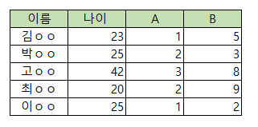

# 정보처리기사 실기 2020년 2회

## 1. 다음 Java로 구현된 프로그램을 분석하여 그 실행 결과를 쓰시오.

```java
class Main {
    public static void main(String[] args) {
        int[] a = new int[]{1, 2, 3, 4};
        int[] b = new int[]{1, 2, 3, 4};
        int[] c = new int[]{1, 2, 3};

        check(a, b);
        check(a, c);
        check(b, c);
    }

    public static void check(int[] a, int[] b) {
        if (a==b) {
            System.out.print("O");
        }else{
            System.out.print("N");
        }

    }
}
```

<details>
<summary>정답</summary>

**_NNN_**

</details>

<details>
<summary>정리</summary>
<div markdown="1">

1. 정수 배열 `a`, `b`, `c`를 초기화
2. `check` 메서드를 호출
   - 두 배열을 매개변수로 받음
   - `a==b` 두 배열의 주소가 일치해야 조건 일치
3. `check(a, b)`: 배열의 원소는 완전히 일치하지만, 두 배열은 다른 주소를 참조하기 때문에 `false` (N)
4. `check(a, c)`, `check(b, c)`: 배열의 주소, 원소 모두 불일치
5. <b>출력</b>: NNN

</div>

</details>

## 2. 다음 내용이 설명하는 용어를 쓰시오.

시스템의 성능을 향상시키고 개발 및 운영의 편의성 등을 높이기 위해 정규화된 데이터 모델을 의도적으로 통합, 중복, 분리하여 정규화 원칙을 위배하는 행위

<details>
<summary>정답</summary>

**_비정규화_**

</details>

## 3. 다음은 SQL에 관한 문제이다. 아래 SQL 구문의 빈칸을 작성하시오.

[테이블]

사원 [사원번호(PK), 이름, 나이, 부서]
부서 [사원번호(PK), 이름, 주소, 나이]

1. 신입사원이 들어와서 부서 테이블에 새로운 사람을 추가
   INSERT INTO 부서 (사원번호, 이름, 주소, 나이) ( ① ) (240728, '홍길동', '서울', 30);

2. 부서 테이블에서 추가한 사원을 검색한 후 사원 테이블에 추가
   INSERT INTO 사원 (사원번호, 이름, 나이, 부서)
   ( ② ) 사원번호, 이름, 나이, ‘영업’ FROM 부서 WHERE 이름 = '홍길동';

3. 전체 사원 테이블 조회
   SELECT \* ( ③ ) 사원;

4. 사원의 퇴사로 인해 부서에 해당하는 값을 '퇴사'로 변경
   UPDATE 사원 ( ④ ) 부서 = '퇴사' WHERE 사원번호 = 240728;

<details>
<summary>정답</summary>

**_1) values 2) select 3) from 4) set_**

</details>

<details>
<summary>정리</summary>
<div markdown="1">

1. 부서 테이블에 새로운 사람을 추가
   - `INSERT INTO 부서 (사원번호, 이름, 주소, 나이) (1) (240728, '홍길동', '서울', 30)`
   - INSERT INTO문에서 데이터 값들을 명시하기 위해 `values`를 사용해야 한다.
2. 추가한 사원을 검색한 후 사원 테이블에 추가
   - `INSERT INTO 사원 (사원번호, 이름, 주소, 나이) (2) 사원번호, 이름, 나이, '영업' FROM 부서 WHERE 이름 = '홍길동'`
   - `select`를 통해 '부서' 테이블에서 값을 가져와 INSERT 할 수 있다.
3. 전체 사원 테이블 조회
   - `SELECT * (3) 사원`
   - 테이블을 참조할 때는 `from`을 사용한다.
4. 부서에 해당하는 값을 '퇴사'로 변경
   - `UPDATE 사원 (4) 부서 = '퇴사' WHERE 사원번호 = 240728`
   - UPDATE 문에서는 `set`을 사용하여 변경할 컬럼과 값을 지정한다.

</div>

</details>

## 4. 다음 릴레이션의 Cardinality와 Degree를 작성하시오.



Cardinality : ( ① )

Degree : ( ② )

<details>
<summary>정답</summary>

**_1) 5 2) 4_**

</details>

## 5. 다음은 프로토콜에 대한 내용이다. 아래 내용을 읽고 알맞는 답을 작성하시오.

- Network layer에서 IP패킷을 암호화하고 인증하는 등의 보안을 위한 표준이다.
- 기업에서 사설 인터넷망으로 사용할 수 있는 VPN을 구현하는데 사용되는 프로토콜이다.
- AH(Authentication Header)와 ESP(Encapsulating Security Payload)라는 두 가지 보안 프로토콜을 사용한다.

<details>
<summary>정답</summary>

**_IPSec_**

<b>키워드: 암호화, 인증, AH, ESP</b>

</details>

## 6. 다음은 Python에 대한 문제이다. 아래 코드를 읽고 알맞는 출력 값을 작성하시오.

```python
def fnCalculation(x,y):
    result = 0;
    for i in range(len(x)):
     temp = x[i:i+len(y)]
     if temp == y:
       result += 1;
    return result

a = "abdcabcabca"
p1 = "ab";
p2 = "ca";

out = f"ab{fnCalculation(a,p1)}ca{fnCalculation(a,p2)}"
print(out)
```

<details>
<summary>정답</summary>

**_ab3ca3_**

</details>

<details>
<summary>정리</summary>
<div markdown="1">

<b>f-string</b>: 사용방법은 <b style="text-decoration:underline">문자열 앞에 접두사 f를 붙이고, 중괄호 `{}` 안에 변수를 넣는 것</b>이다.

1. 원본 문자열: `"abdcabcabca"`
2. 찾을 패턴1: `"ab"`
3. 찾을 패턴2: `"ca"`
4. `fnCalculation()` 함수 호출
   - `for i in range(len(x)):` 문자열 `x`의 길이만큼 반복(11)
   - `temp = x[i:i+len(y)]`: i부터 문자열 `y`의 길이만큼 자름
     - `ab, bd, dc, ca, ab, bc, ca, ab, bc, ca`
   - `if temp == y:`: 문자열 `y`와 비교하여 일치하면 result + 1
     - `y = ab`: result = 3
     - `y = ca`: result = 3
5. `f"ab{fnCalculation(a,p1)}ca{fnCalculation(a,p2)}"`: f-string의 내부 함수를 계산한 결과
   - `ab3ca3`
6. <b>출력</b>: ab3ca3

</div>

</details>

## 7. 아래 설명하는 내용을 확인하여 알맞는 알고리즘을 작성하시오.

- 대칭키 알고리즘으로 1997년 NIST(미국 국립기술표준원)에서 DES를 대체하기 위해 생성되었다.
- 128비트, 192비트 또는 256비트의 가변 키 크기와 128비트의 고정 블록 크기를 사용한다.
- 높은 안전성과 효율성, 속도 등으로 인해 DES 대신 전 세계적으로 많이 사용되고 있다.

<details>
<summary>정답</summary>

**_AES_**

</details>

<details>
<summary>정리</summary>
<div markdown="1">

- <b>DES(Data Encryption Standard)</b>

  - 1977년 미국의 연방정보처리 표준 규격(FIPS)로 채택된 대칭 암호
  - <b style="text-decoration:underline">56비트의 키</b>를 이용하는 대칭키 암호시스템
  - <b style="text-decoration:underline">페이스텔 구조</b>의 암호화 방식

- <b>AES(Advanced Encryption Standard)</b>
  - 1997년 NIST에서 <b style="text-decoration:underline">DES를 대체</b>하기 위해 생성
  - 128비트 평문을 <b style="text-decoration:underline">128비트로 암호화</b>
  - <b style="text-decoration:underline">비페이스텔 구조</b>의 암호화 바익

</div>

</details>

## 8. 패킷 교환 방식 중에 연결형과 비연결형에 해당하는 방식을 작성하시오.

① 연결형 교환 방식

② 비연결형 교환 방식

<details>
<summary>정답</summary>

**_1. 가상 회선 2. 데이터그램_**

</details>

<details>
<summary>정리</summary>
<div markdown="1">

- <b>가상 회선(Virtual Circuit)</b>: 통신 전에 <b style="text-decoration:underline">논리적인 경로를 미리 설정</b>하여 동일한 경로로 패킷을 전송하는 방식
  - 마치 전용 회선을 설정한것처럼 동작하지만, 실제로는 여러 사용자가 물리적 회선을 공유하는 방식
  - 연결형 서비스
- <b>데이터그램 방식(Datagram)</b>: 데이터를 패킷(데이터그램) 단위로 나누어, 각 패킷이 <b style="text-decoration:underline">독립적으로 경로를 결정하여 전송</b>하는 패킷 교환 방식
  - 각 패킷이 도착한 순서가 달라질 수 있고, 네트워크 상황에 따라 최적의 경로가 변경될 있음
  - 비연결형 서비스

</div>

</details>

## 9. 모듈에 대한 다음 설명에 해당하는 응집도(Cohesion)를 에서 찾아 쓰시오.

실행 순서가 밀접한 관계를 갖는 기능을 모아 모듈로 구성한다.
한 모듈 내부의 한 기능 요소에 의한 출력 자료가 다음 기능 원소의 입력 자료로서 제공되는 형태이다.

보기

ㄱ. 기능적(functional) ㄴ. 우연적(Coincidental) ㄷ. 통신적(Communication) ㄹ. 절차적(Procedural) ㅁ. 시간적(Temporal) ㅂ. 순차적(sequential) ㅅ. 논리적(Logical)

<details>
<summary>정답</summary>

**_ㅂ. 순차적_**

</details>

<details>
<summary>정리</summary>
<div markdown="1">

<b>응집도(Cohesion)</b>: 하나의 클래스가 기능에 집중하기 위한 모든 정보의 역할을 갖고 있어야 한다는 의미이다.

1. <b>기능적 응집도(Funcional)</b>
   - 가장 응집도가 높은 형태로 가장 좋은 형태
   - 모듈 내부의 모든 기능이 <b style="text-decoration:underline">단일 목적</b>을 위해 수행되는 경우
2. <b>순차적 응집도(Sequential)</b>
   - 모듈 내에서 한 활동으로 부터 나온 <b style="text-decoration:underline">출력값이 다음 활동의 입력 데이터로 사용</b>될 경우
   - 어떤 모듈이 특정 파일을 읽고 처리하는 기능을 하는 것
3. <b>교환적 응집도(Communicaion)</b>
   - 통신적 응집도라고도 불림
   - <b style="text-decoration:underline">동일한 입력과 출력을 사용해 서로 다른 기능을 수행</b>하는 구성요소들이 모였을 경우의 응집도
4. <b>절차적 응집도(Procedural)</b>
   - 하나의 모듈이 <b style="text-decoration:underline">특정한 순서</b>로 수행되어야 하는 여러 작업을 포함하지만, 그 작업들이 논리적으로 밀접하게 관련되어 있지 않은 경우
   - 순서상 같이 수행되기 때문에 묶여 있는 것이지, 하나의 목적이나 공통 데이터 때문에 묶인 거은 아니다.
5. <b>시간적 응집도(Temporal)</b>
   - 일시적 응집도라고도 불림
   - 각 기능 요소들이 <b style="text-decoration:underline">순서에 상관없이 특정 시점에 반드시 수행</b>되는 경우
   - 연관된 기능이라기 보단 특정 시간에 처리되어야하는 활동들을 한 모듈에서 처리하는 경우
6. <b>논리적 응집도(Logical)</b>
   - 유사한 성격을 갖거나 특정 형태로 분류되는 처리 요소들이 한 모듈에서 처리되는 경우
   - 논리적 비슷한 기능을 수행하지만 <b style="text-decoration:underline">서로의 관계는 밀접하지 않은</b> 형태
   - switch문이 쓰여 case에 따라 비슷하지만 다른 작업을 수행하는 경우
7. <b>우연적 응집도(Coincidental)</b>
   - 가장 좋지 않은 응집도
   - 모듈 내부의 각 구성 요소들이 서로 관련업는 요소로만 구성된 경우

</div>

</details>

## 10. 아래는 디자인 패턴에 관한 설명이다. 아래 설명을 읽고 보기에서 알맞는 용어를 작성하시오.

- 컬렉션 객체의 내부 구조를 노출하지 않고 순차적으로 접근할 수 있게 하는 패턴이다.
- 이 패턴은 객체의 내부 표현 방식에 독립적으로 요소에 접근할 수 있도록 해준다
- 반복 프로세스를 캡슐화하여 클라이언트 코드에서는 컬렉션의 구체적인 구현에 종속되지 않도록 한다.


<details>
<summary>정답</summary>

**_Iterator_**

<b>키워드: 순차적, 컬렉션</b>

</details>

## 11.

<details>
<summary>정답</summary>

**_a_**

</details>

<details>
<summary>정리</summary>
<div markdown="1">

</div>

</details>

## 12.

<details>
<summary>정답</summary>

**_a_**

</details>

<details>
<summary>정리</summary>
<div markdown="1">

</div>

</details>

## 13.

<details>
<summary>정답</summary>

**_a_**

</details>

<details>
<summary>정리</summary>
<div markdown="1">

</div>

</details>

## 14.

<details>
<summary>정답</summary>

**_a_**

</details>

<details>
<summary>정리</summary>
<div markdown="1">

</div>

</details>

## 15.

<details>
<summary>정답</summary>

**_a_**

</details>

<details>
<summary>정리</summary>
<div markdown="1">

</div>

</details>

## 16.

<details>
<summary>정답</summary>

**_a_**

</details>

<details>
<summary>정리</summary>
<div markdown="1">

</div>

</details>

## 17.

<details>
<summary>정답</summary>

**_a_**

</details>

<details>
<summary>정리</summary>
<div markdown="1">

</div>

</details>

## 18.

<details>
<summary>정답</summary>

**_a_**

</details>

<details>
<summary>정리</summary>
<div markdown="1">

</div>

</details>

## 19.

<details>
<summary>정답</summary>

**_a_**

</details>

<details>
<summary>정리</summary>
<div markdown="1">

</div>

</details>

## 20.

<details>
<summary>정답</summary>

**_a_**

</details>

<details>
<summary>정리</summary>
<div markdown="1">

</div>

</details>
