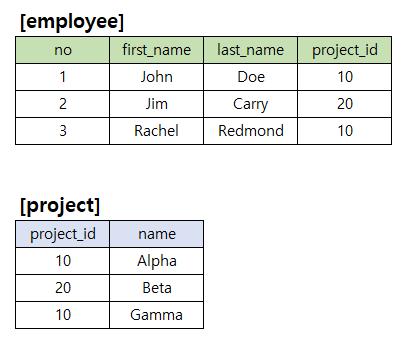
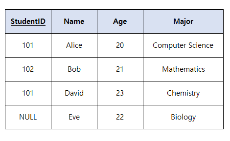
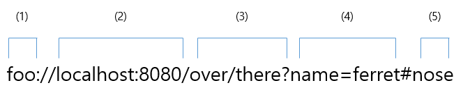
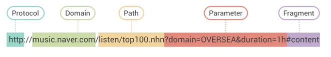
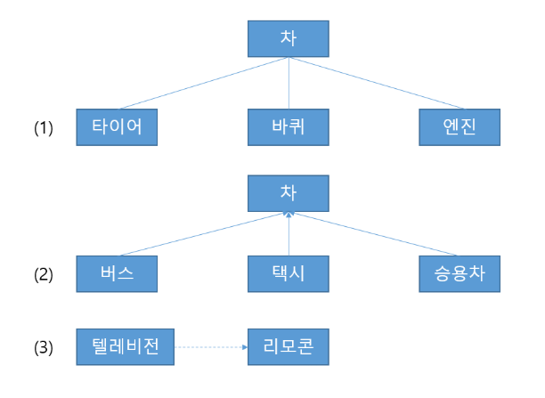

# 정보처리기사 실기 2020년 2회

## 1. 아래 자바 코드에서 출력되는 값을 작성하시오.

```java
public class Main {
    static void func(String[] m, int n) {
        for (int i = 1; i < n; i++) {
            if (m[i-1].equals(m[i])) {
                System.out.print("O");
            } else {
                System.out.print("N");
            }
        }

        for (String mo : m) {
            System.out.print(mo);
        }
    }

    public static void main(String[] args) {
        String[] m = new String[3];
        m[0] = "A";
        m[1] = "A";
        m[2] = new String("A");
        func(m, 3);
    }
}
```

<details>
<summary>정답</summary>

**_OOAAA_**

</details>

<details>
<summary>정리</summary>
<div markdown="1">

1. `new String[3]` 길이가 3인 문자열 배열 선언
2. 배열 `m`에 "A"를 3번 할당
   - `m[2]`는 `new String("A")를 사용하여 새로운 객체를 생성
   - `m[0]`과 `m[1]`은 동일한 객체지만 `m[2]`는 새로운 객체이다.
3. `func(m,3)` 함수 호출
   - `if (m[i-1].equals(m[i]))` 배열의 이전 원소와 현재 원소가 같다면
     - "O"를 출력
   - 아니라면
     - "N"을 출력
   - 이후 문자열 `m`을 순환하며 각 문자를 출력
4. <b>출력</b>: OOAAA

<br>

- Java에서는 문자열 리터럴 `"A"`는 String Pool이라는 특별한 메모리 공간에 저장됨
- 동일한 리터럴 `"A"`를 여러 번 사용하면 같은 String 객체를 재사용한다.
- `new String("A")`는 새로운 객체를 힙에 생성한다.
- 따라서 내용은 `"A"`로 같지만, 주소가 다름
- ```java
  m[0] == m[2] // false
  m[0].equals([m[2]]) // true
  ```

</div>

</details>

## 2. 아래 코드에서 출력되는 값을 작성하시오.

```python
def test(lst):
	for i in range(len(lst) // 2):
		lst[i], lst[-i-1] = lst[-i-1], lst[i]
ls = [1,2,3,4,5,6]
test(ls)
print(sum(ls[::2]) - sum(ls[1::2]))
```

<details>
<summary>정답</summary>

**_3_**

</details>

<details>
<summary>정리</summary>
<div markdown="1">

1. 배열 `ls`를 인자로 `test` 함수 호출
2. `for i in range(len(lst) // 2)`: 배열 길이의 절반(3)만큼 반복
3. `lst[i], lst[-i-1] = lst[-i-1], lst[i]`: 배열의 대칭되는 원소를 치환
   - ls = [6,5,4,3,2,1]
4. `sum(ls[::2])`: 배열의 짝수 인덱스를 전부 더함
   - 6 + 4 + 2 = 12
5. `sum(ls[1::2])`: 배열의 홀수 인덱스를 전부 더함
   - 5 + 3 + 1 = 9
6. <b>출력</b>: 3

</div>

</details>

## 3. 아래의 employee테이블과 project테이블을 참고하여 보기의 SQL명령어에 알맞는 출력 값을 작성하시오.



```sql
SELECT
    count(*)
FROM employee AS e JOIN project AS p ON e.project_id = p.project_id
WHERE p.name IN (
    SELECT name FROM project p WHERE p.project_id IN (
        SELECT project_id FROM employee GROUP BY project_id HAVING count(*) < 2
    )
);
```

<details>
<summary>정답</summary>

**_1_**

</details>

<details>
<summary>정리</summary>
<div markdown="1">

1. `SELECT project_id FROM employee GROUP BY project_id HAVING count(*) < 2`: employee 테이블에서 project_id를 그룹화하고, 직원 수가 2명 미만인 project_id (20)
2. `SELECT name FROM project p WHERE p.project_id IN (20)`: project 테이블에서 project_id가 20인 튜플의 name (Beta)
3. `FROM employee AS e JOIN project AS p ON e.project_id = p.project_id WHERE p.name IN (Beta)`: employee와 project 테이블을 project_id가 같은 것끼리 조인한 릴레이션에서 p.name이 Beta인 튜플의 개수
4. p.name이 20인 경우는 양쪽 테이블 모두 하나 뿐이기 때문에 정답은 1

</div>

</details>

## 4. LRU 페이지 교체 알고리즘에 따른 페이지 부재 횟수를 작성하시오. (프레임 3칸)

7 0 1 2 0 3 0 4 2 3 0 3 2 1 2 0 1 7 0 1

<details>
<summary>정답</summary>

**_12_**

</details>

<details>
<summary>정리</summary>
<div markdown="1">

<b>LRU(Least Recently Used)</b>: 가장 오랫동안 사용되지 않은 것을 교체하는 알고리즘

1. 7 (부재 1)
2. 7 0 (부재 2)
3. 7 0 1 (부재 3)
4. 0 1 2 (부재 4)
5. 1 2 0
6. 2 0 3 (부재 5)
7. 2 3 0
8. 3 0 4 (부재 6)
9. 0 4 2 (부재 7)
10. 4 2 3 (부재 8)
11. 2 3 0 (부재 9)
12. 2 0 3
13. 0 3 2
14. 3 2 1 (부재 10)
15. 3 1 2
16. 1 2 0 (부재 11)
17. 2 0 1
18. 0 1 7 (부재 12)
19. 1 7 0
20. 7 0 1

</div>

</details>

## 5. 다음으로 알맞은 용어를 작성하시오

ICMP, 송신 주소를 공격 대상의 IP 주소로 위장하고, 수신 주소를 해당 네트워크 라우터의 브로드캐스트 주소로 설정하는 공격으로 과부화 시키는 기법은? ICMP 패킷을 크게 만들어서 과부화 시키는 죽음의 핑과 같은 서비스 공격 유형이다.

<details>
<summary>정답</summary>

**_스머핑_**

</details>

<details>
<summary>정리</summary>
<div markdown="1">

- <b>스푸핑 (Spoofing)</b>: `속이다`, 다른 사람이나 단체의 신원으로 위조하여 시스템에 접근하거나 통신하는 해킹 기법
  - <b>키워드: 위조, 속이다</b>
- <b>스니핑 (Sniffing)</b>: `냄새를 맡다`, 네트워크 상에서 자신이 아닌 다른 상대방들의 패킷 교환을 엿듣는 해킹 기법
  - <b>키워드: 엿듣다, 도청</b>
- <b>스머핑 (Smurfing)</b>: DDoS 공격의 한 종류로, 피해 서버의 IP 주소를 위조하여 수많은 ICMP 패킷을 네트워크의 브로드캐스트 주소로 보내, 네트워크에 연결된 모든 기기들이 응답하게 만들어 서버를 마비시키는 방식
  - <b>키워드: ICMP, 브로드캐스트, DoS</b>

</div>

</details>

## 6. 다음은 GoF 디자인 패턴과 관련된 문제이다. 괄호안에 알맞는 용어를 작성하시오.

- ( ) 패턴은 클래스나 객체들이 서로 상호작용하는 방법이나 책임 분배 방법을 정의하는 패턴이다.
- ( ) 패턴은 객체들 간의 통신 방법을 정의하고 알고리즘을 캡슐화하여 객체 간의 결합도를 낮춘다.
- ( ) 패턴은 Chain of Responsibility나 Command 또는 Observer 패턴이 있다.

<details>
<summary>정답</summary>

**_행위_**

</details>

<details>
<summary>정리</summary>
<div markdown="1">

- <b>생성 패턴(Creational)</b>: 객체의 생성 방식을 결정하는 패턴
  - 팩토리 메소드(Factory Method)
  - 추상 팩토리(Abstract Factory)
  - 빌더(Builder)
  - 프로토타입(Prototype)
  - 싱글톤(Singleton)
- <b>구조 패턴(Structural)</b>: 클래스나 객체를 조합해 더 큰 구조를 만드는 패턴
  - 어댑터(Adaptor)
  - 브리지(Bridge)
  - 컴포지트(Composite)
  - 데코레이터(Decorator)
  - 퍼싸드(Facade)
  - 플라이웨이트(Flyweight)
  - 프록시(Proxy)
- <b>행위(Behavioral)</b>: 객체나 클래스 사이의 알고리즘이나 책임 분배에 관련된 패턴
  - 책임 연쇄(Chain of Responsibility)
  - 커맨드(Command)
  - 인터프린터(Interpreter)
  - 반복자(Iterator)
  - 중재자(Mediator)
  - 메멘토(Memento)
  - 옵서버(Observer)
  - 상태(State)
  - 전략(Strategy)
  - 템플릿 메소드(Template Method)
  - 방문자(Visitor)

</div>

</details>

## 7. 다음은 C언어에 대한 문제이다. 아래 코드를 확인하여 알맞는 출력값을 작성하시오.

```c
#include <stdio.h>

int func(){
 static int x =0;
  x+=2;
  return x;
}

int main(){
  int x = 1;
  int sum=0;
  for(int i=0;i<4;i++) {
    x++;
    sum+=func();
  }
  printf("%d", sum);

  return 0;
}
```

<details>
<summary>정답</summary>

**_20_**

</details>

<details>
<summary>정리</summary>
<div markdown="1">

1. `for`문을 반복하며, `x`를 1씩 증가하고 `func` 함수를 호출하고 `sum`에 더함
2. `func`: 내부의 정적 변수 `x`를 2씩 증가
   - 정적 변수 `x`와 지역 변수 `x`는 다름
   - 정적 변수 `x`는 `2, 4, 6, 8`로 증가
   - `sum = 2 + 4 + 6 + 8 = 20`
3. <b>출력</b>: 20

</div>

</details>

## 8. 다음은 무결성제약조건에 대한 문제이다. 아래 표에서 어떠한 ( ) 무결성을 위반하였는지 작성하시오.



<details>
<summary>정답</summary>

**_개체_**

</details>

## 9. 다음은 URL 구조에 관한 문제이다 . 아래 보기의 순서대로 URL에 해당하는 번호를 작성하시오.



보기

query : 서버에 전달할 추가 데이터
path : 서버 내의 특정 자원을 가리키는 경로

scheme : 리소스에 접근하는 방법이나 프로토콜

authority : 사용자 정보, 호스트명, 포트 번호

fragment : 특정 문서 내의 위치

<details>
<summary>정답</summary>

**_43125_**

</details>

<details>
<summary>정리</summary>
<div markdown="1">



1. <b>Scheme(=Protocol)</b>: 브라우저가 리소스를 요청하기 위해 사용해야 하는 프로토콜을 나타낸다.
   - "HTTP, HTTPS, FTP" + `:`
2. <b>Domain</b>: IP 주소를 갖는 서버를 사용자가 쉽게 기억하고 찾을 수 이도록 만들어준 서비스이다.
3. <b>Port</b>: 서버의 특정 서비스로 접속하기 위한 통로 번호
   - `//` + Domain + `:` + Port
4. <b>Path</b>: 웹사이트 내에서 특정 파일이나 디렉토리의 위치를 나타낸다.
   - `/` + Path
5. <b>Query</b>: 특정 조건에 맞는 데이터를 검색하거나 전달할 때 사용됨
   - `?` + "key=value"
6. <b>Fragment</b>: URL의 특정 부분(주로 페이지 내의 특정 위치)를 가리킬 때 사용됨
   - `#` + Fragment

</div>

</details>

## 10. 다음은 파이썬에 대한 문제이다. 아래 코드를 확인하여 알맞는 출력값을 작성하시오.

```python
def func(value):
    if type(value) == type(100):
        return 100
    elif type(value) == type(""):
        return len(value)
    else:
        return 20


a = '100.0'
b = 100.0
c = (100, 200)

print(func(a) + func(b) + func(c))
```

<details>
<summary>정답</summary>

**_a_**

</details>

<details>
<summary>정리</summary>
<div markdown="1">

1. `a`는 문자열 '100.0'다.
2. `b`는 실수 100.0다.
3. `c`는 배열 (100, 20)이다.
4. 함수 `func`을 호출하고 합한다.
   - `if type(value) == type(100)`: 100은 정수이기 때문에 일치하는 타입은 없음
   - `elif type(value) == type("")`: ""은 문자열이기 때문에 `a`와 일치하고, `100.0`의 길이인 `5`를 반환
   - `return 20`: 나머지 경우인 `b`와 `c`는 `20`을 반환
   - 5 + 20 + 20 = 45
5. <b>출력</b>: 45

</div>

</details>

## 11. 다음은 Java 코드에 대한 문제이다. 아래 코드를 확인하여 알맞는 출력값을 작성하시오.

```java
public class Main{
  public static void main(String[] args){
    Base a =  new Derivate();
    Derivate b = new Derivate();

    System.out.print(a.getX() + a.x + b.getX() + b.x);
  }
}

class Base{
  int x = 3;

  int getX(){
     return x * 2;
  }
}

class Derivate extends Base{
  int x = 7;

  int getX(){
     return x * 3;
  }
}
```

<details>
<summary>정답</summary>

**_a_**

</details>

<details>
<summary>정리</summary>
<div markdown="1">

1. `Base a = new Derivate()`: `Derivate` 인스턴스를 생성하고, 부모 클래스 `Base` 타입으로 형변환 (업캐스팅)
   - <b>x = 7</b>
2. `Derivate b = new Derivate`: `Derivate` 인스턴스를 생성
   - <b>x = 7</b>
3. `a.getX()`: 오버라이딩되어 `Derivate` 클래스의 `getX()`를 호출 (7 \* 3 = 21)
4. `a.x`: 업캐스팅되었기때문에, `Base` 클래스의 `x`를 가져옴 (3)
5. `b.getX()`: `Derivate` 클래스의 `getX()`를 호출 (7 \* 3 = 21)
6. `b.x`: `Derivate` 클래스의 `x`를 가져옴 (7)
7. 21 + 3 + 21 + 7
8. <b>출력</b>: 52

</div>

</details>

## 12. 다음은 C언어에 대한 문제이다. 아래 코드를 확인하여 알맞는 출력값을 작성하시오.

```c
#include <stdio.h>

struct Node {
 int value;
 struct Node* next;
};

void func(struct Node* node){
  while(node != NULL && node->next != NULL){
     int t = node->value;
     node->value = node->next->value;
     node->next->value = t;
     node = node->next->next;
  }
}

int main(){
  struct Node n1 = {1, NULL};
  struct Node n2 = {2, NULL};
  struct Node n3 = {3, NULL};

  n1.next = &n3;
  n3.next = &n2;

  func(&n1);

  struct Node* current = &n1;

  while(current != NULL){
    printf("%d", current->value);
    current = current->next;
 }

 return 0;

}
```

<details>
<summary>정답</summary>

**_312_**

</details>

<details>
<summary>정리</summary>
<div markdown="1">

1. 연결리스트 형태의 구조체 `Node`
2. `n1`, `n2`, `n3`에 `1,2,3`을 할당
3. `n1.next`에 `n3`를 연결, `n3.next`에 `n2`를 연결
   - n1->n3->n2
4. `func(&n1)` 호출
   - `while(node != NULL && node->next != NULL)`: 노드가 NULL이 될 때까지 반복
   - `int t = node->value`: 노드의 값을 `t`에 할당
   - `node.value = node.next.value`: 다음 노드의 값을 현재 노드의 값에 할당
   - `node.next.value = t`: 다음 노드의 값에 현재 값을 할당
   - `node = node.next.next`: 다다음 노드를 `node`에 할당
   - `n1`과 `n3`의 값을 치환
5. `current` 노드에 `n1`을 할당
6. <b>출력</b>: 312

</div>

</details>

## 13. 다음은 테스트 커버리지에 대한 문제이다. 아래 내용에 알맞는 답을 보기에서 골라 작성하시오.

1. 테스트를 통해 프로그램의 모든 문장을 최소한 한 번씩 실행했는지를 측정
2. 프로그램 내의 모든 분기(조건문)의 각 분기를 최소한 한 번씩 실행했는지를 측정
3. 복합 조건 내의 각 개별 조건이 참과 거짓으로 평가되는 경우를 모두 테스트했는지를 측정

보기
ㄱ. 조건 ㄴ. 경로 ㄷ. 결정 ㄹ. 분기 ㅁ.함수 ㅂ. 문장 ㅅ. 루프

<details>
<summary>정답</summary>

**_1) ㅂ.문장 2) ㄹ.분기 3) ㄱ.조건_**

</details>

## 14. 아래는 UML클래스의 관계에 관한 문제이다. 보기를 보고 알맞는 관계를 선택하여 작성하시오.



보기
ㄱ. 의존 ㄴ. 연관 ㄷ. 일반화

<details>
<summary>정답</summary>

**_1)ㄴ.연관 2)ㄷ.일반화 3)ㄱ.의존_**

</details>

<details>
<summary>정리</summary>
<div markdown="1">

- <b>일반화 관계</b>: 상위 클래스와 하위 클래스간의 관계를 나타낸다.
  - `동물`이라는 상위 클래스와 이를 상속받는 `고양이`와 `강아지` 클래스가 있다.
- <b>연관 관계</b>: 두 객체 간의 구조적 관계를 나타낸다.
  - `차`가 `타이어, 바퀴, 엔진`같은 부품으로 이루어져 있는 것을 나타낸다.
- <b>의존 관계</b>: `한 객체`가 `다른 객체의 기능을 사용`할 때 그 객체에 대한 의존 관계를 나타낸다.
  - `자동차`가 `엔진`이 있어야 동작하는 것을 나타낸다.

</div>

</details>

## 15. 다음은 데이터베이스에 관한 문제이다. 아래 내용을 읽고 알맞는 답을 보기에서 찾아 골라 작성하시오.

1. 다른 테이블, 릴레이션의 기본 키를 참조하는 속성 또는 속성들의 집합
2. 테이블에서 각 행을 유일하게 식별할 수 있는 최소한의 속성들의 집합
3. 후보 키 중에서 선정된 기본 키를 제외한 나머지 후보 키
4. 테이블에서 각 행을 유일하게 식별할 수 있는 속성들의 집합

ㄱ. 슈퍼키 ㄴ. 외래키 ㄷ. 대체키 ㄹ. 후보키

<details>
<summary>정답</summary>

**_1)ㄴ.외래키 2)ㄹ.후보키 3)ㄷ.대체키 4)ㄱ.슈퍼키_**

</details>

## 16. 다음은 C언어에 대한 문제이다. 아래 코드를 확인하여 알맞는 출력값을 작성하시오.

```c
#include <stdio.h>

void func(int** arr, int size){
  for(int i=0; i<size; i++){
     *(*arr + i) = (*(*arr+i) + i) % size;
  }
}

int main(){
  int arr[] = {3,1, 4, 1, 5};
  int* p = arr;
  int** pp = &p;
  int num = 6;

  func(pp, 5);
  num = arr[2];
  printf("%d", num);

  return 0;
}
```

<details>
<summary>정답</summary>

**_a_**

</details>

<details>
<summary>정리</summary>
<div markdown="1">

1. 정수 배열 `arr`을 초기화
2. `p`는 배열의 주소, `pp`는 포인터 `p`의 주소를 가리킴
3. `func(pp, 5)` 함수를 호출
   - `*(*arr + i)`: `*arr`은 배열 첫번째 원소의 주소이며, `i`는 반복문을 통해 각 원소를 순회
   - `*(*arr+i) + i`: 위와 마찬가지로 원소의 값을 가져오고 `i`를 더함, 이후에 `size`를 나누고 나머지를 가져옴
   - `arr[0] = (arr[0] + 0) % size = 3 % 5 = 3`
   - `arr[1] = (arr[1] + 1) % size = 2 % 5 = 2`
   - `arr[2] = (arr[2] + 2) % size = 6 % 5 = 1`
   - `arr[3] = (arr[3] + 3) % size = 4 % 5 = 4`
   - `arr[4] = (arr[4] + 4) % size = 9 % 5 = 4`
4. `num = arr[2]`: 1
5. <b>출력</b>: 1

</div>

</details>

## 17. 다음 아래 내용을 보고 알맞는 용어를 작성하시오. (3글자로 작성)

- 공용 네트워크를 통해 사설 네트워크를 확장하는 기술이다.
- 사용자의 IP 주소를 숨기고, 사용자가 어디에서 접속하는지를 추적하기 어렵게 만든다.
- 종류로는 IPsec 또는 SSL, L2TP 등이 있다.

<details>
<summary>정답</summary>

**_VPN_**

</details>

<details>
<summary>정리</summary>
<div markdown="1">

<b>VPN(Virtual Privae Network)</b>: 인터넷 통신을 암호화하고 IP주소를 변경하여 개인 정보 보호, 보안 강화, 인터넷 검열 우회 등을 목적으로 사용된다.

- <b>프로토콜</b>: IPsec, SSL/LS, L2TP, PPTP 등

</div>

</details>

## 18. 다음은 Java 코드에 대한 문제이다. 아래 코드를 확인하여 알맞는 출력값을 작성하시오.

```java
public class ExceptionHandling {
  public static void main(String[] args) {
      int sum = 0;
      try {
          func();
      } catch (NullPointerException e) {
          sum = sum + 1;
      } catch (Exception e) {
          sum = sum + 10;
      } finally {
          sum = sum + 100;
      }
      System.out.print(sum);
  }

  static void func() throws Exception {
      throw new NullPointerException();
  }
}
```

<details>
<summary>정답</summary>

**_101_**

</details>

<details>
<summary>정리</summary>
<div markdown="1">

1. `try`문을 실행
   - `func()` 메서드를 호출
   - `throw new NullPointerException()`: 예외를 반환
2. `catch (NullPointerException e)` 해당하는 예외를 catch
3. `sum = sum + 1`: 0 + 1 = 1
4. `catch`문이 실행되었으니, `finally`를 실행
5. `sum = sum + 100`: 1 + 100 = 101
6. <b>출력</b>: 101

</div>

</details>

## 19. 다음은 Java 코드에 대한 문제이다. 아래 코드를 확인하여 알맞는 출력값을 작성하시오.

```java
class Main {

  public static class Collection<T>{
    T value;

    public Collection(T t){
        value = t;
    }

    public void print(){
       new Printer().print(value);
    }

   class Printer{
      void print(Integer a){
        System.out.print("A" + a);
      }
      void print(Object a){
        System.out.print("B" + a);
      }
      void print(Number a){
        System.out.print("C" + a);
      }
   }
 }

  public static void main(String[] args) {
      new Collection<>(0).print();
  }

}
```

<details>
<summary>정답</summary>

**_B0_**

</details>

<details>
<summary>정리</summary>
<div markdown="1">

1. `new Collection<>(0).print()`: `Collection` 인스턴스를 생성하고, `print` 메서드를 호출
   - 제네릭 타입이 비어있기 때문에, 오토박싱을 통해 래퍼(wrapper) 클래스 객체로 자동 변환
   - 0은 `int` 리터럴이지만 오토박싱을 통해 `Integer`이 된다.
2. 생성자 함수 실행 `value = t` (value = 0)
3. `print` 메서드 실행

   - 하지만 컴파일 이후에는 타입 소거에 의해 제네릭 정보(T)가 지워진다.
   - 지워진 후에는 `Object`로 취급된다.

   * `new Printer().print(Object)`: 내부 클래스 `Printer` 인스턴스를 생성하고 `print` 메서드를 호출

4. 오버로딩을 통해 `print(Object a)` 매개변수가 정수인 메서드를 실행
   - `"B" + a` = B0
5. <b>출력</b>: B0

</div>

</details>

## 20. 아래 설명에 맞는 용어를 작성하시오.

- 중앙 관리나 고정된 인프라 없이 임시로 구성되는 네트워크이다.
- 일반적으로 무선 통신을 통해 노드들이 직접 연결되어 데이터를 주고받는다.
- 긴급 구조, 긴급 회의, 군사적인 상황 등에서 유용하게 활용될 수 있다.

ㄱ. Infrastructure Network ㄴ. Firmware Network ㄷ. Peer-to-Peer Network ㄹ. Ad-hoc Network ㅁ. Mesh Network ㅂ.Sensor Network ㅅ.Virtual Private Network

<details>
<summary>정답</summary>

**_ㄹ.Ad-hoc Network_**

</details>

<details>
<summary>정리</summary>
<div markdown="1">

- <b>Infrastructure Network</b>: 기반 시설이 존재하는 네트워크. 즉, <b style="text-decoration:underline">중앙에 통신 장비</b>가 이고, 모든 노드는 이 장비를 통해 통신한다.
  - 중앙 집중형 구조
  - 주로 Wi-Fi, 기업 LAN, 이동통신망에서 사용됨
- <b>Firmware Network</b>: 네트워크 장비에 내장된 <b style="text-decoration:underline">펌웨어</b>가 관리하거나 제어하는 내부 네트워크 환경을 의미한다.
  - 장비 내부에서 동작하는 임베디드 네트워크나 디바이스간 통신 제어에 사용됨
  - IoT 기기, 임베디드 시스템에서 자주 등장
- <b>Peer-to-Peer(P2P) Network</b>: 모든 노드가 <b style="text-decoration:underline">동등한 지위</b>를 가지며, 서버 없이 직접 연결되어 통신하는 구조
  - 중앙 서버가 없음
  - 각 노드가 클라이언트이자 서버 역할
  - 확장성은 좋지만, 관리 및 보안이 어렵다.
- <b>Ad-hoc Network</b>: <b style="text-decoration:underline">기존 인프라 없이</b> 디바이스들이 <b style="text-decoration:underline">즉석에서 직접 연결</b>되어 형성되는 네트워크
  - "Ad-hoc" = 즉석의, 임시의
  - 중앙 장비 없음
  - 노드 간 직접 연결
  - 전쟁터, 재난 현장 등에서 이미로 구성된 네트워크나 휴대폰 간 Wi-Fi Direct 연결 등이 있다.
- <b>Mesh Network</b>: 모든 노드가 다수의 다른 노드와 연결되어, <b style="text-decoration:underline">그물망 형태</b>로 구성된 네트워크
  - 일종의 "Ad-hoc" 네트워크의 발전형
  - 트래픽이 자동으로 다른 경로로 우회 가능
  - 자가복구, 자가구성 가능
  - IoT 스마트홈 네트워크, 군사용 통신망 등
- <b>Sensor Network</b>: <b style="text-decoration:underline">센서 노드</b>들이 무선으로 연결되어 <b style="text-decoration:underline">환경 데이터를 수집,전송</b>하는 네트워크
  - 데이터 수집 중심
  - 노드간 협력적 통신
  - 환경 모니터링, 스마트 농장, 스마트 시티 등
- <b> Virtual Privae Network</b>: 공용 네트워크 위에 <b style="text-decoration:underline">암호화된 가상 터널</b>을 만들어 사설망처럼 안전하게 데이터를 주고받는 기술
  - 보안성 강화, 원격 접속 가능
  - IP가 변환되어 익명성 제공 가능
  - 회사 사내망 원격 접속, 개인 VPN 등

</div>

</details>
