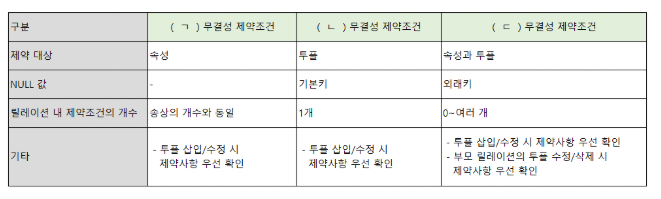
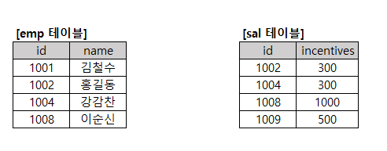
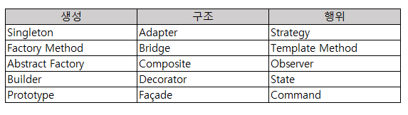
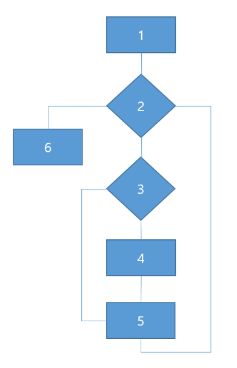

# 정보처리기사 실기 2025년 1회

## 1. 다음은 네트워크 보완에 관련된 문제이다. 괄호안에 알맞는 용어를 작성하시오.

( )은/는 '세션을 가로채다.' 라는 의미로 다른 사람의 세션 상태를 훔치거나 도용하여 액세스하는 해킹 기법이다.

TCP ( )은/는 TCP의 3-way 핸드셰이크가 완료된 후에 공격자가 시퀀스 번호 등을 조작하여 정상적인 세션을 가로채고 인증 없이 통신을 탈취하는 공격 공격이다.

<details>
<summary>정답</summary>

**_세션 하이재킹_**

</details>

## 2. 다음은 제약조건과 관련된 문제이다. 괄호안에 알맞는 용어를 보기에 골라 작성하시오.



<details>
<summary>정답</summary>

**_ㄱ.도메인 ㄴ.개체 ㄷ.참조_**

</details>

<details>
<summary>정리</summary>
<div markdown="1">

- <b>개체 무결성</b>: 기본키를 구성하는 어떤 속성도 NULL/중복 값을 가질 수 없음
- <b>도메인 무결성</b>: 릴레이션 내 튜플들이 각 속성의 도메인에 지정된 값만 가짐
- <b>참조 무결성</b>: 외래키는 NULL 또는 참조 릴레이션의 기본키 값과 동일

</div>

</details>

## 3. 아래의 내용에서 설명 글의 괄호안의 용어를 영문 약자로 작성하시오.

( ) 은/는 3글자의 영어 약자로 이루어진 오류 기법으로 데이터를 전송하거나 저장할 때 데이터의 오류를 감지하는 데 사용되는 오류 검출 코드이다.

( ) 은/는 데이터에 체크섬을 추가하여 데이터를 전송하거나 저장한 후, 수신 또는 읽을 때 이 체크섬을 다시 계산하여 데이터가 변경되었는지 확인하는 기법이다.

( ) 은/는 데이터 전송의 안정성을 높이는 데 중요한 역할을 한다.

데이터는 이진수(0과 1)로 표현되며 정해진 다항식(x³ + x + 1)을 기반으로 데이터를 2진수 나눗셈하고나머지를 ( ) 값으로 삼는다.

<details>
<summary>정답</summary>

**_CRC_**

</details>

<details>
<summary>정리</summary>
<div markdown="1">

<b>CRC(Cyclic Redundancy Check)</b>: 순환 중복 검사의 약자로, 데이터 전송 중 오류가 발생했는지 확인하기 위해 사용되는 수학적 기법이다. 데이터를 보내기 전에 <b>체크섬</b>이라는 오류 감지 코드를 생성하여 데이터와 함께 보내고, 수신된 데이터에서 이 코드를 다시 계산해 비교함으로써 오류를 감지한다.

<b>키워드: 체크섬, 오류</b>

</div>

</details>

## 4. 다음은 악성코드 관련된 문제이다. 아래 내용을 확인하여 보기에 골라 작성하시오.

사용자가 원치 않는 소프트웨어를 구매하도록 조작하기 위해 사회 공학을 사용하여 충격, 불안 또는 위협에 대한 인식을 유발하는 악성 소프트웨어의 한 형태이다.

‘겁을 주다’라는 영어 단어에서 유래한 것으로 공포를 이용하여 피해자를 속여 대가를 지불 하거나 특정 행동을 유도하는 랜섬웨어이다.

가짜 바이러스 경고나 시스템 문제를 표시하여 사용자가 돈을 지불하거나 특정 소프트웨어를 설치하도록 속이는 방식으로 작동한다.

보기
ㄱ. 컴포넌트 웨어 ㄴ. 유즈웨어 ㄷ. 셔블웨어 ㄹ. 스캐어 웨어 ㅁ. 안티 스파이 웨어 ㅂ. 네트웨어 ㅅ. 그룹웨어 ㅇ. 애드웨어

<details>
<summary>정답</summary>

**_ㄹ. 스캐어 웨어_**

</details>

<details>
<summary>정리</summary>
<div markdown="1">

- <b>유즈웨어(Useware)</b>: 사용자가 쓰기 편하도록 만든 소프트웨어나 시스템 설계 방식
- <b>셔블웨어(Showware)</b>: 겉보기에만 화려하고 실제 기능이나 성능은 부족한 소프트웨어
- <b>스캐어웨어(Scareware)</b>: 사용자를 겁주거나 속여서 불필요한 행동을 하게 만드는 악성 소프트웨어
- <b>안티 스파이 웨어(Anti Spyware)</b>: 스파이웨어로부터 컴퓨터를 보호해주는 백신 프로그램
- <b>네트웨어(Netware)</b>: 여러 대의 컴퓨터가 네트워크로 연결되어 자원을 공유할 수 있게 해주는 서버용 운영체제
- <b>그룹웨어(Groupware)</b>: 조직 내 여러 구성원들이 공동의 목표를 위해 함께 일할 수 있도록 지원하는 소프트웨어
- <b>애드웨어(Adware)</b>: 사용자의 동의 없이 광고를 보여주거나, 광고를 통해 수익을 얻도록 설계된 소프트웨어

</div>

</details>

## 5. 다음은 Java 코드에 대한 문제이다. 아래 코드를 확인하여 알맞는 출력값을 작성하시오.

```java
public class Main {

  public static void main(String[] args) {

    int a=5,b=0;

    try{
      System.out.print(a/b);
    }catch(ArithmeticException e){
      System.out.print("출력1");
    }catch(ArrayIndexOutOfBoundsException e) {
      System.out.print("출력2");
    }catch(NumberFormatException e) {
      System.out.print("출력3");
    }catch(Exception e){
      System.out.print("출력4");
    }finally{
      System.out.print("출력5");
    }
  }
}
```

<details>
<summary>정답</summary>

**_출력1출력5_**

</details>

<details>
<summary>정리</summary>
<div markdown="1">

1. `try`문을 통해 `a/b`를 실행
2. `5/0`은 수학적 오류이므로 `ArithmeticException e`로 처리한다.
3. 마지막으로 `finally`문이 실행
4. <b>출력</b>: 출력1출력5

- <b>ArithmeticException e</b>: 수학적 오류 발생 시 (0으로 나누기)
- <b>NullPointerException e</b>: null 객체 참조
- <b>ArrayIndexOutBoundsException e</b>: 배열 인덱스 범위 초과
- <b>NumberFormatException e</b>: 문자열을 순자로 변환 실패
- <b>Exception e</b>: 가장 일반적인 예외이기 때문에 반드시 catch 블록 중 맨 뒤에 둬야한다.
- try catch문은 앞에서 예외가 처리되면, 뒤의 catch 블럭은 모두 무시된다.
- catch 블록은 <b>구체적 예외 -> 일반적 예외</b>순서로 작성해야 한다.

</div>

</details>

## 6. 아래 내용은 ARP/RARP에 대한 설명이다. 각 설명에 해당하는 것을 작성하시오.

( 1 ) 은/는 네트워크상에서 IP 주소를 MAC 주소로 변환하는 프로토콜이고,

( 2 ) 은/는 MAC 주소를 IP 주소로 변환하는 프로토콜이다.

<details>
<summary>정답</summary>

**_1.ARP 2.RARP_**

</details>

## 7. 다음은 SQL 문제이다. 아래 두 테이블을 참고하여 보기에 쿼리 실행 결과를 작성하시오.



```sql
SELECT name, incentive FROM emp, sal WHERE emp.id = sal.id and incentives >= 500
```

<details>
<summary>정답</summary>

**_이순신 1000_**

</details>

## 8. 아래는 데이터베이스에 관련된 설명이다. 알맞는 용어를 보기에서 골라 괄호를 작성하시오.

1. 릴레이션에서 속성의 개수를 의미 : ( 1 )

2. 릴레이션에서 튜플의 개수를 의미 : ( 2 )

3. 한 릴레이션의 속성이 다른 릴레이션의 기본 키를 참조할 때, 참조하는 속성을 의미 : ( 3 )

4. 특정 속성에 대해 입력될 수 있는 값의 유형이나 범위를 의미하고 무결성을 보장하는 기준 : ( 4 )

[보기]
ㄱ. domain ㄴ. primary ㄷ. degree ㄹ. candidate ㅁ. cardinality ㅂ. attribute ㅅ. foreign

<details>
<summary>정답</summary>

**_1.ㄷ degree 2.ㅁ cardinality 3.ㅅ foreign 4.ㄱ domain_**

</details>

<details>
<summary>정리</summary>
<div markdown="1">

</div>

</details>

## 9. IP 주소가 192.168.35.10, 서브넷 255.255.252.0인 PC에서 브로드캐스팅으로 다른 IP로 정보를 전달한다고 할 때 수신할 수 있는 알맞는 IP를 보기에서 골라 모두 작성하시오.

[보기]

ㄱ. 192.168.34.1
ㄴ. 192.168.32.19
ㄷ. 192.168.35.200
ㄹ. 192.168.33.138
ㅁ. 192.168.35.50

<details>
<summary>정답</summary>

**_ㄱㄴㄷㄹㅁ_**

</details>

<details>
<summary>정리</summary>
<div markdown="1">

<b>서브넷</b>: /22

1. <b>네트워크 주소</b>

   - <b>세 번째 옥텟</b>: 11111100 AND 00100011 = 00100000 -> 32
   - <b>네 번째 옥텟</b>: 00000000 AND 00001010 = 00000000 -> 0

   <b>-> 192.168.32.0</b>

2. <b>브로드캐스트 주소</b>: 호스트 비트를 모두 1로 만든 주소 (호스트 비트: 8)

   - <b>세번째 옥텟</b>: 00100000 -> 00100011 = 32 + 3 = 35
   - <b>네번째 옥텟</b>: 00000000 -> 11111111 = 255

   <b>-> 192.168.35.255</b>

3. <b>호스트 주소 범위</b>: 네트워크 주소와 브로드캐스트 주소 사이
   - 192.168.32.1 ~ 192.168.35.254

- ㄱ. 192.168.34.1 (ㅇ)
- ㄴ. 192.168.32.19 (ㅇ)
- ㄷ. 192.168.35.200 (ㅇ)
- ㄹ. 192.168.33.138 (ㅇ)
- ㅁ. 192.168.35.50 (ㅇ)

</div>

</details>

## 10. 다음은 C언어에 대한 문제이다. 아래 코드를 확인하여 알맞는 출력값을 작성하시오.

```c
#include <stdio.h>
char Data[5] = {'B', 'A', 'D', 'E'};
char c;

int main(){
    int i, temp, temp2;

    c = 'C';
    printf("%d\n", Data[3]-Data[1]);

    for(i=0;i<5;++i){
        if(Data[i]>c)
            break;
    }

    temp = Data[i];
    Data[i] = c;
    i++;

    for(;i<5;++i){
        temp2 = Data[i];
        Data[i] = temp;
        temp = temp2;
    }

    for(i=0;i<5;i++){
        printf("%c", Data[i]);
    }
}
```

<details>
<summary>정답</summary>

**_a_**

</details>

<details>
<summary>정리</summary>
<div markdown="1">

1. 변수 `c`를 문자 `C`로 초기화
2. `Data[3]-Data[1]` = 69 - 65 = 4
3. `Data[i]`가 `c`보다 커질때까지 `i`를 증가 (i = 2)
4. `2`를 `temp`에 할당하고, 그 자리에 `c`를 할당, 그리고 i + 1 ({'B', 'A', 'C', 'E'}, i = 3)
5. `i`를 1씩 증가하며 `temp`와 교환 ({'B', 'A', 'C', 'D', 'E'})
6. <b>출력</b>: 4(줄바꿈) BACDE

</div>

</details>

## 11. 다음은 C언어에 대한 문제이다. 아래 코드를 확인하여 알맞는 출력값을 작성하시오.

```c
#include <stdio.h>
#include <stdlib.h>

void set(int** arr, int* data, int rows, int cols) {
    for (int i = 0; i < rows * cols; ++i) {
        arr[((i + 1) / rows) % rows][(i + 1) % cols] = data[i];
    }
}

int main() {
    int rows = 3, cols = 3, sum = 0;
    int data[] = {5, 2, 7, 4, 1, 8, 3, 6, 9};
    int** arr;
    arr = (int**) malloc(sizeof(int*) * rows);
    for (int i = 0; i < cols; i++) {
        arr[i] = (int*) malloc(sizeof(int) * cols);
    }

    set(arr, data, rows, cols);

    for (int i = 0; i < rows * cols; i++) {
        sum += arr[i / rows][i % cols] * (i % 2 == 0 ? 1 : -1);
    }

    for(int i=0; i<rows; i++) {
        free(arr[i]);
    }
    free(arr);

    printf("%d", sum);
}

```

<details>
<summary>정답</summary>

**_13_**

</details>

<details>
<summary>정리</summary>
<div markdown="1">

1. `rows = 3, cols = 3` 3\*3 배열 크기 지정
2. `arr = (int**) malloc(sizeof(int*) * rows)`: 행의 개수만큼 `int`을 담을 공간을 만듬
3. `arr[i] = (int*) malloc(sizeof(int) * cols)`: 각 행에 정수 배열 공간을 하나씩 만듬
4. `set(arr, data, rows, cols)` 함수 실행
5. `arr`의 0행 0열부터 3행 3열까지 `data` 배열의 원소를 할당
   - arr = {{9,5,2},{7,4,1},{8,3,6}}
6. `sum += arr[i / rows][i % cols] * (i % 2 == 0 ? 1 : -1)`: 배열 내의 값을 `sum`에 더하고 빼기를 반복 (9-5+2-7+4-1+8-3+6, sum = 13)
7. `free(arr[i]), free(arr)` 할당된 메모리들을 해제
8. <b>출력</b>: 13

</div>

</details>

## 12. 다음은 결합도와 관련된 내용이다. 보기에 알맞는 답을 골라 작성하시오.

(1) 다른 모듈 내부에 있는 변수나 기능을 다른 모듈에서 사용하는 경우의 결합도

(2) 모듈 간의 인터페이스로 배열이나 오브젝트, 자료구조 등이 전달되는 경우의 결합도

(3) 파라미터가 아닌 모듈 밖에 선언되어 있는 전역 변수를 참조하고 전역 변수를 갱신하는 식으로 상호작용하는 경우의 결합도

[보기]

ㄱ. 자료 결합도 ㄴ. 스탬프 결합도 ㄷ. 제어 결합도 ㄹ. 공통 결합도 ㅁ. 내용 결합도 ㅂ. 외부 결합도

<details>
<summary>정답</summary>

**_(1) ㅁ. 내용 결합도 (2) ㄴ. 스탬프 결합도 (3) ㄹ. 공통 결합도_**

</details>

<details>
<summary>정리</summary>
<div markdown="1">

<b>결합도(Coupling)</b>: 모듈간의 상호 의존 정도 또는 연관된 관계의 끈끈함 정도를 의미한다. 좋은 소프트웨어는 낮은 결합도를 가지고 있다.

<b>결합도 단계 종류</b>

1. <b>자료 결합도(Data Coupling)</b>
   - 가장 결합도가 낮고, 가장 좋은 형태
   - 모듈끼리 <b style="text-decoration:underline">단순히 데이터</b>를 주고 받는 경우
   - 기능 수행에 있어서 로직을 제어하거나 하지 않는 순수한 자료형 요소의 데잍러르 주고 받는 것
2. <b>스탬프 결합도(Stamp Coupling)</b>
   - 두 모듈이 인터페이스로 배열이나 오브젝트 같은 동일한 <b style="text-decoration:underline">자료 구조</b>를 참조하는 형태의 결합도
   - 만일 모듈에 쓰일 자료구조 형태가 변경되면 그것을 참조하는 모든 모듈에 영향을 주게 됨
3. <b>제어 결합도(Control Coupling)</b>
   - 어떤 모듈이 다른 모듈 내부의 <b style="text-decoration:underline">논리적인 흐름을 제어하는 제어 요소</b>를 전달하는 경우
   - 상위 모듈이 하위 모듈의 상세한 처리 절차를 알고 있어 이를 통제하는 경우
4. <b>외부 결합도(External Coupling)</b>
   - 모듈이 <b style="text-decoration:underline">외부에 있는 다른 모듈의 데이터</b>를 참조할 때의 결합도
   - 외부의 데이터, 통신 프로토콜 등을 공유할 때 발생
   - 어떤 외부 모듈에서 반환한 값을 다른 모듈에서 참조하는 경우
5. <b>공통 결합도(Common Coupling)</b>
   - 여러 개의 모듈이 하나의 <b style="text-decoration:underline">공통 데이터 영역</b>을 사용하는 결합도
   - 대표적으로 <b style="text-decoration:underline">전역 변수</b>를 예로 들 수 있음
   - 공통 데이터 영역의 내용을 조금만 변경하더라도 이를 사용하는 모든 모듈에 영향을 미침
6. <b>내용 결합도(Content Coupling)</b>
   - 가장 높은 결합도를 가지며, 가장 좋지 않은 결합 형태
   - 어떤 모듈을 사용하려면 <b style="text-decoration:underline">다른 모듈 내부 기능과 데이터를 직접 참조해 그대로 가져와 사용하거나 수정</b>하는 경우

</div>

</details>

## 13. 다음은 Java 코드에 대한 문제이다. 아래 코드를 확인하여 알맞는 출력값을 작성하시오.

```java
public class Main {
    public static void main(String[] args) {
        new Child();
        System.out.println(Parent.total);
    }
}


class Parent {
    static int total = 0;
    int v = 1;

    public Parent() {
        total += (++v);
        show();
    }

    public void show() {
        total += total;
    }
}


class Child extends Parent {
    int v = 10;

    public Child() {
        v += 2;
        total += v++;
        show();
    }

    @Override
    public void show() {
        total += total * 2;
    }
}
```

<details>
<summary>정답</summary>

**_a_**

</details>

<details>
<summary>정리</summary>
<div markdown="1">

1. `new Child()` 인스턴스를 생성
2. 부모 클래스인 `Parent`의 생성자 함수 우선 실행
3. `total += (++v)` total = 2
4. `show` 메서드 실행 (오버라이드) `total += total * 2` (total=6, v=2)
5. `Child`의 생성자 함수 실행
6. `v += 2` v = 12, `total += v++` (total=18, v=13)
7. `show` 메서드 실행 `total += total * 2` (total=54)
8. <b>출력</b>: 54

</div>

</details>

## 14. 아래는 디자인 패턴에 대한 설명이다. 알맞는 답을 보기에 골라 작성하시오



서로 다른 인터페이스를 가진 클래스들을 연결해 사용 가능하게 한다.

기존 클래스(Adaptee)를 원하는 인터페이스(Target)에 맞게 변환하는 어댑터(Adapter)를 만든다.

기존 클래스를 감싸서(wrapper) 인터페이스를 변환해주는 역할을 한다.

<details>
<summary>정답</summary>

**_Adapter_**

</details>

<details>
<summary>정리</summary>
<div markdown="1">

<b>어댑터 패턴(Adapter Pattern)</b>: 호환성이 없는 인터페이스 때문에 함께 동작할 수 없는 클래스들을 함께 작동해주도록 변환 역할을 해주는 행동 패턴

</div>

</details>

## 15. 문장(Statement) 커버리지 테스트를 수행하려고 한다. 코드를 아래의 제어 흐름도 빈칸에 연결되도록 작성하고 문장 커버리지 순서대로 작성하시오.



```java
int Main(int b[], int m, int x) {
    int a = 0;
    while (a < m || b[a] < x) {
        if (b[a] < 0)
            b[a] = -b[a];
        a++;
    }
    return 1;
}
```

보기

1. ( ① ) 2. ( ② ) 3. ( ③ ) 4. ( ④ ) 5. ( ⑤ ) 6. ( ⑥ )
   문장 커버리지 순서 1 → 2 → ( ⑦ )

<details>
<summary>정답</summary>

**_1. `int a = 0` 2. `while(a < m || b[a] < x)` 3. `b[a] < 0` 4. `b[a] = -b[a]` 5. `a++` 6. `return 1` 7. `3->4->5->2->6`_**

</details>

<details>
<summary>정리</summary>
<div markdown="1">

<b>문장 커버리지</b>: 모든 문장이 적어도 한 번 실행

</div>

</details>

## 16. 다음은 Java 코드에 대한 문제이다. 아래 코드를 확인하여 알맞는 출력값을 작성하시오.

```java
public class Main {

    public static void main(String[] args) {
        int[] data = {3, 5, 8, 12, 17};
        System.out.println(func(data, 0, data.length - 1));
    }

    static int func(int[] a, int st, int end) {
        if (st >= end) return 0;
        int mid = (st + end) / 2;
        return a[mid] + Math.max(func(a, st, mid), func(a, mid + 1, end));
    }

}
```

<details>
<summary>정답</summary>

**_20_**

</details>

<details>
<summary>정리</summary>
<div markdown="1">

1. `int[] data = {3,5,8,12,17}` 정수 배열을 선언
2. `func(data, 0, data.length - 1)` 함수를 호출
3. `if (st >= end) return 0` 매개변수 `st`와 `end`가 같거나 보다 크면 0을 반환
4. `int mid = (st + end) / 2` 중간 인덱스를 계산
5. `return a[mid] + Math.max(func(a, st, mid), func(a, mid+1, end))`: 중간 인덱스를 기준으로 좌 우측으로 `func`함수를 재귀 호출하고, 최고값을 찾아 중간 값과 더함
   - <b>func(0,4), mid=2, a[2]=8</b>
   - `8 + Math.max(func(0,2), func(3,4))`
     - <b>func(0,2), mid=1, a[1]=5</b>
     - `5 + Math.max(func(0,1), func(2,2))`
       - <b>func(0,1), mid=0, a[0]=3</b>
       - `3 + Math.max(func(0,0), func(1,1))`
         - <b>func(0,0) = 0, func(1,1) = 0</b>
         - <b>3</b>
       - <b>func(0,1) = 3, func(2,2) = 0</b>
       - <b>3</b>
     - <b>3 + 5 = 8</b>
     - <b>func(3,4), mid=3, a[3]=12</b>
     - `12 + Math.max(func(3,3), func(4,4))`
       - <b>func(3,3) = 0, func(4,4) = 0</b>
       - <b>12</b>
   - <b>func(0,2) = 8, func(3,4) = 12</b>
   - <b>8 + 12 = 20</b>
6. <b>출력</b>: 20

</div>

</details>

## 17. 다음은 파이썬에 대한 문제이다. 아래 코드를 확인하여 알맞는 출력값을 작성하시오.

```python
class Node:
    def __init__(self, value):
        self.value = value
        self.children = []

def tree(li):
    nodes = [Node(i) for i in li]
    for i in range(1, len(li)):
        nodes[(i - 1) // 2].children.append(nodes[i])
    return nodes[0]

def calc(node, level=0):
    if node is None:
        return 0
    return (node.value if level % 2 == 1 else 0) + sum(calc(n, level + 1) for n in node.children)

li = [3, 5, 8, 12, 15, 18, 21]

root = tree(li)

print(calc(root))
```

<details>
<summary>정답</summary>

**_13_**

</details>

<details>
<summary>정리</summary>
<div markdown="1">

1. `nodes = [Node(i) for i in li]` 배열을 순회하며 각각 `Node` 인스턴스를 생성하고 `value`에 값을 넣음
2. `nodes[(i - 1) // 2].children.append(nodes[i])`: 완전 이진 트리 형태로 변환
   - `//` 정수 나눗셈(몫만 구하기)
3. `return nodes[0]` 헤드 노드를 반환
4. `calc(root)` 헤드 노드를 인자로 `calc`함수를 호출
5. `return (node.value if level % 2 == 1 else 0) + sum(calc(n, level + 1) for n in node.children)`
   - `level`이 홀수면 노드값을 더하고, 짝수면 0을 더한다.
   - 노드의 자식 노드를 기준으로 `level`을 1씩 높여가며 반복
   - `level = 0` = 0
   - `level = 1` = 5 + 8 = 13
   - `level = 2` = 0
6. <b>출력</b>: 13

</div>

</details>

## 18. 다음은 C언어에 대한 문제이다. 아래 코드를 확인하여 알맞는 출력값을 작성하시오.

```c
#include <stdio.h>
#include <stdlib.h>

typedef struct Data {
    int value;
    struct Data *next;
} Data;

Data* insert(Data* head, int value) {
    Data* new_node = (Data*)malloc(sizeof(Data));
    new_node->value = value;
    new_node->next = head;
    return new_node;
}

Data* reconnect(Data* head, int value) {
    if (head == NULL || head->value == value) return head;
    Data *prev = NULL, *curr = head;
    while (curr != NULL && curr->value != value) {
        prev = curr;
        curr = curr->next;
    }

    if (curr != NULL && prev != NULL) {
        prev->next = curr->next;
        curr->next = head;
        head = curr;
    }
    return head;
}

int main() {

    Data *head = NULL, *curr;
    for (int i = 1; i <= 5; i++)
        head = insert(head, i);
    head = reconnect(head, 3);
    for (curr = head; curr != NULL; curr = curr->next)
        printf("%d", curr->value);
    return 0;
}

```

<details>
<summary>정답</summary>

**_35421_**

</details>

<details>
<summary>정리</summary>
<div markdown="1">

1. 연결 리스트 형태의 구조체 `Data`
2. 제일 앞의 데이터 `head`와 현재 데이터를 담을 `curr` 데이터를 선언
3. `head = insert(head, i)`: `insert` 함수를 실행
   - `Data* new_node = (Data*)malloc(sizeof(Data))`: 새로운 노드를 삽입할 메모리를 할당
   - 이후 `value`를 할당하고, 기존의 `head`를 새 노드의 `next`에 할당
   - 반환된 `new_node`를 `head`로 변환
   - <b>결과</b>: 5->4->3->2->1
4. `head = reconnect(head, 3)`: `reconnect` 함수를 실행
   - `if (head == NULL || head->value == value) return head`: 들어온 `head`값이 NULL이거나, `value`가 3일 경우 `head`를 반환
   - `while (curr != NULL && curr->value != value)`: 현재값이 NULL이거나 `value`가 3이 될 때까지 반복
   - `prev = curr; curr = curr->next`: 위의 조건에 해당할 때까지 `next`로 이동
     - <b>prev = 4, curr = 3</b>
   - `if (curr != NULL && prev != NULL)`: 현재나 이전 값이 NULL이 아닐 때
   - `prev->next = curr->next; curr->next = head head = curr`
     - <b>4.next = 2, 3.next = 5, head = 3</b>
5. `for (curr = head; curr != NULL; curr = curr->next) printf("%d", curr->value)`: `head`부터 NULL값이 나올때까지 출력
6. <b>출력</b>: 35421

</div>

</details>

## 19. 다음은 C언어에 대한 문제이다. 아래 코드를 확인하여 알맞는 출력값을 작성하시오.

```c
#include <stdio.h>

typedef struct student {
    char* name;
    int score[3];
} Student;

int dec(int enc) {
    return enc & 0xA5;
}

int sum(Student* p) {
    return dec(p->score[0]) + dec(p->score[1]) + dec(p->score[2]);
}

int main() {
    Student s[2] = { "Kim", {0xA0, 0xA5, 0xDB}, "Lee", {0xA0, 0xED, 0x81} };
    Student* p = s;
    int result = 0;

    for (int i = 0; i < 2; i++) {
        result += sum(&s[i]);
    }
    printf("%d", result);
    return 0;
}

```

<details>
<summary>정답</summary>

**_a_**

</details>

<details>
<summary>정리</summary>
<div markdown="1">

1. 이름과 점수 배열을 가진 구조체 `student`
2. `result += sum(&s[i])`: 배열 `s`의 각 원소를 인자로 `sum` 함수를 호출
3. `return dec(p->score[0]) + dec(p->score[1]) + dec(p->score[2])` 배열의 모든 원소에 대해 `dec` 함수를 호출
4. `return enc & 0xA5` 점수에 대해 `0xA5`와 `&` 연산을 실행 (0xA5 = 10100101)
   - 0xA0 => 0xA0 = 160
   - 0xA5 => 0xA5 = 165
   - 0xDB => 11011011 & 10100101 = 10000001 = 0x81 = 129
   - 0xA0 => 0xA5 = 160
   - 0xED => 11101101 & 10100101 = 10100101 = 0xA5 = 165
   - 0x81 => 10000001 & 10100101 = 10000001 = 0x81 = 129
   - (165 + 160 + 129) _ 2 = 454 _ 2 = 908
5. <b>출력</b>: 908

</div>

</details>

## 20. 다음은 Java 코드에 대한 문제이다. 아래 코드를 확인하여 알맞는 출력값을 작성하시오.

```java
public class Main {
  public static void main(String[] args) {
    System.out.println(calc("5"));
  }

  static int calc(int value) {
    if (value <= 1) return value;
    return calc(value - 1) + calc(value - 2);
  }

  static int calc(String str) {
    int value = Integer.valueOf(str);
    if (value <= 1) return value;
    return calc(value - 1) + calc(value - 3);
  }
}
```

<details>
<summary>정답</summary>

**_4_**

</details>

<details>
<summary>정리</summary>
<div markdown="1">

1. `calc("5")` 메서드를 호출 (매개변수: 문자열)
2. `int value = Integer.valueOf(str)`: 정수로 변환
3. `if (value <= 1)`: 5는 1보다 크므로 조건 불일치
4. `return calc(value - 1) + calc(value - 3)` = `return calc(4) + calc(2)`(매개변수: 정수)
   - `calc(2)` => `return calc(1) + calc(0)`
     - `calc(1)` => `return 1`
     - `calc(0)` => `return 0`
     - `calc(2)` = 1
   - `calc(4) + calc(2)`
   - = `[calc(3) + calc(2)] + 1`
   - = `[calc(2) + calc(1) + 1] + 1`
   - = `4`
5. <b>출력</b>: 4

</div>

</details>
