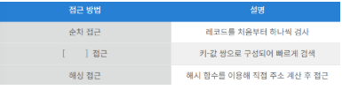

# 정보처리기사 실기 2025년 2회

## 1. 다음은 파일 구조와 관련된 설명이다. 설명을 읽고 괄호 안에 들어갈 가장 알맞은 용어를 작성하시오.



데이터베이스의 물리 설계 시, 레코드에 접근하는 방법은 순차 접근 방법, [   ] 방법, 해싱 방법 등이 있다.

이 중 [   ] 방법은 레코드의 키 값과 포인터를 쌍으로 묶어 저장하며 검색 시 키 값을 기준으로 빠르게 탐색할 수 있도록 설계되어 있다.

이 방식은 검색 속도가 빠르며 쌍으로 구성된 자료 구조를 사용하여 해당 키가 가리키는 주소를 통해 원하는 레코드를 직접 찾을 수 있다.

<details>
<summary>정답</summary>

**_인덱스_**

</details>

<details>
<summary>정리</summary>
<div markdown="1">

<b>파일 구조</b>: 데이터를 저장하고 관리하는 방식으로, 효율적인 데이터 접근과 처리를 위해 사용된다.
파일 구조에 따라 <b style="text-decoration:underline">데이터의 저장, 접근, 검색, 수정 속도</b>가 달라지므로, 절저한 구조를 선택하는 것이 중요하다.

- <b>순차 파일(Sequential File)</b>: <b style="text-decoration:underline">레코드를 일정한 논리적 순서에 따라 저장</b>하는 방식

  - 데이터가 연속된 물리적 공간에 저장되므로 <b style="text-decoration:underline">처리 속도가 빠르다</b>.
  - 레코드를 추가할 경우, 기존 데이터 <b style="text-decoration:underline">끝부분</b>에만 삽입된다.
  - 특정 데이터를 검색할 때 처음부터 순차적으로 찾아야 하므로, <b style="text-decoration:underline">검색 속도가 느릴 수 있다</b>.
  - 주로 <b style="text-decoration:underline">테이프 저장 장치</b>에서 많이 사용된다.

- <b>직접 파일(Direct File)</b>: <b style="text-decoration:underline">레코드를 임의의 물리적 공간에 저장하는 방식</b>으로, 특정 데이터를 빠르게 찾을 수 있다.

  - <b style="text-decoration:underline">해시 함수를 사용하여 데이터의 저장 위치를 결정</b>하므로 검색 속도가 빠르다.
  - 특정 데이터만 빠르게 조회하는 작업에 유리하지만, 데이터가 많아지면 충돌 문제가 발생할 수 있다.
  - 주로 <b style="text-decoration:underline">온라인 트랜잭션 처리 시스템(OLTP)</b>에서 많이 사용된다.

- <b>색인 순차 파일(Indexed Sequential File)</b>: <b style="text-decoration:underline">순차 파일과 직접 파일의 장점을 결합한 방식</b>으로, <b style="text-decoration:underline">색인</b>을 사용해 검색 속도를 향상 시킨다.
  - 레코드는 순차적으로 저장되지만, <b style="text-decoration:underline">색인을 통해 원하는 데이터를 빠르게 검색</b>할 수 있다.
  - 파일이 크더라도 색인을 활용하면 전체 데이터를 검색하지 않아도 된다.
  - 주로 <b style="text-decoration:underline">대형 데이터베이스 시스템</b>에서 사용된다.

</div>

</details>

## 2. 다음은 데이터베이스 릴레이션의 구성 요소 중 하나에 대한 설명이다. 설명을 읽고 보기에서 알맞은 기호를 골라 작성하시오.

릴레이션(Relation)에서 열(Column)을 의미하며 데이터 항목의 속성(Attribute) 또는 특성을 나타낸다.

각 열은 고유한 이름을 가지며 특정 도메인(Domain)에서 정의된 값을 갖는다.

예를 들어 "학생" 릴레이션에서 학번, 이름, 전공 등은 각각 하나의 열이며 이 열들은 학생의 고유한 속성을 나타낸다.

이 개념은 파일 구조에서의 필드(Field)에 해당하며 릴레이션에서 행(Row, Tuple)의 구성 요소가 된다.

[보기]
ㄱ. Cardinality
ㄴ. Domain
ㄷ. Attribute
ㅁ. Degree
ㅂ. Schema
ㅅ. Tuple

<details>
<summary>정답</summary>

**_ㄷ Atrribute_**

</details>

<details>
<summary>정리</summary>
<div markdown="1">

- <b>Cardinality</b>: 튜플의 수를 나타냄
- <b>Domain</b>: 특정 속성이 가질 수 있는 값의 전체 집합을 의미함
- <b>Attribute</b>: 릴레이션의 열을 의미하며, 데이터의 속성 또는 특성을 나타냄
- <b>Degree</b>: 열의 수를 의미함
- <b>Schema</b>: 릴레이션의 구조 전체를 정의하는 것으로, 여러 속성들의 집합을 포함
- <b>Tuple</b>: 릴레이션의 각 행, 즉 개별 레코드를 나타냄

</div>

</details>

## 3. 다음은 정보보안 관련 문제이다. 아래 내용을 보고 알맞는 단어를 작성하시오.

원격 접속과 관련된 보안 프로토콜이며 암호화된 통신을 제공하는 보안 접속용 프로토콜이다.
공개키 기반의 인증 방식을 사용하며 암호화된 데이터 전송을 지원한다.
주로 원격 서버에 안전하게 접속할 때 사용되며 기본 포트 번호는 22번이다.
Telnet의 보안 취약점을 보완한 대안으로 널리 사용된다.

<details>
<summary>정답</summary>

**_SSH_**

</details>

<details>
<summary>정리</summary>
<div markdown="1">

<b>SSH(SecureSHell)</b>: 네트워크를 통해 다른 컴퓨터에 안전하게 접속하고 명령을 실행하며 파일을 전송하는데 사용되는 네트워크 프로토콜이다.

- TCP 기본 포트 번호는 22번이다.
- Telnet의 보안 취약점을 보완한 대안으로 널리 사용된다.
- 공개키 기반 인증

</div>

</details>

## 4. 스케줄링 알고리즘에 관한 다음 설명을 읽고 (1)과 (2)에 알맞은 스케줄링 알고리즘의 명칭을 각각 쓰시오.

(1) CPU burst 시간이 짧은 프로세스를 우선적으로 처리하는 스케줄링 방식이다. "Shortest Next CPU Burst"라고도 불리며 선점형 또는 비선점형으로 구현될 수 있다.

(2) 위의 스케줄링 방식을 선점형으로 구현한 형태로 실행 중인 프로세스보다 더 짧은 burst 시간을 가진 프로세스가 도착하면 현재 CPU를 선점한다.

<details>
<summary>정답</summary>

**_(1) SJF (2) SRT_**

</details>

## 5. 다음은 Java의 문제이다. 아래 코드를 보고 알맞는 출력값을 작성하시오.

```java
public class Main {
    public static void change(String[] data, String s){
        data[0] = s;
        s = "Z";
    }

    public static void main(String[] args) {
        String data[] = { "A" };
        String s = "B";

        change(data, s);
        System.out.print(data[0] + s);
    }
}

```

<details>
<summary>정답</summary>

**_a_**

</details>

<details>
<summary>정리</summary>
<div markdown="1">

1. 문자열 배열 `data`를 `{ "A" }`로 선언
2. 문자열 변수 `s`를 `"B"`로 초기화
3. `change(data, s)`함수를 호출
4. <b>data[0] = s</b>: 배열 `data`의 인덱스 0번째 값을 `s`로 변경 (data = `{ "B" }`)
   - 배열은 값이 아닌 값의 주소를 할당하므로, main 함수의 `data` 배열의 값이 직접 변경됨
5. <b>s = "Z"</b>: 매개변수 `s`에 `"Z"`를 할당
   - 매개변수 `s`는 main 함수의 변수 `s`와는 다른 change 함수의 변수 `s`이다
6. <b>출력</b>: BB

</div>

</details>

## 6. 다음은 IP 주소와 서브넷 마스크에 관한 문제이다. 주어진 정보를 참고하여 괄호 안에 들어갈 알맞은 값을 쓰시오.

호스트의 IP 주소가 223.13.234.132이고 서브넷 마스크가 255.255.255.192일 때 다음 물음에 답하시오.

이 호스트가 속한 네트워크 주소는 223.13.234.( ① )이다.

이 네트워크에서 사용 가능한 호스트 수는 ( ② )개이다.

(단, 네트워크 주소와 브로드캐스트 주소는 제외한다.)

<details>
<summary>정답</summary>

**_1.128 2.62_**

</details>

<details>
<summary>정리</summary>
<div markdown="1">

<b>서브넷 마스크</b>가 255.255.255.192 일 때, 이 서브넷을 `/26`이라 부른다.

네 번째 옥텟은 192(11000000)으로 표현할 수 있으며, 앞의 2비트는 네트워크를 나타내고, 나머지 6비트가 호스트를 나타낸다.

가능한 서브넷의 마지막 옥텟 값은: 0, 64, 128, 192가 되고,
호스트의 주소가 132이기 때문에 129~191 범위가 속한 네트워크 주소는 `128`이 된다.

이 네트워크에서 사용 가능한 호스트 수는 129에서 191 사이이기 때문에 191 - 129 = `62`

</div>

</details>

## 7.

<details>
<summary>정답</summary>

**_a_**

</details>

<details>
<summary>정리</summary>
<div markdown="1">

</div>

</details>

## 8.

<details>
<summary>정답</summary>

**_a_**

</details>

<details>
<summary>정리</summary>
<div markdown="1">

</div>

</details>

## 9.

<details>
<summary>정답</summary>

**_a_**

</details>

<details>
<summary>정리</summary>
<div markdown="1">

</div>

</details>

## 10.

<details>
<summary>정답</summary>

**_a_**

</details>

<details>
<summary>정리</summary>
<div markdown="1">

</div>

</details>

## 11.

<details>
<summary>정답</summary>

**_a_**

</details>

<details>
<summary>정리</summary>
<div markdown="1">

</div>

</details>

## 12.

<details>
<summary>정답</summary>

**_a_**

</details>

<details>
<summary>정리</summary>
<div markdown="1">

</div>

</details>

## 13.

<details>
<summary>정답</summary>

**_a_**

</details>

<details>
<summary>정리</summary>
<div markdown="1">

</div>

</details>

## 14.

<details>
<summary>정답</summary>

**_a_**

</details>

<details>
<summary>정리</summary>
<div markdown="1">

</div>

</details>

## 15.

<details>
<summary>정답</summary>

**_a_**

</details>

<details>
<summary>정리</summary>
<div markdown="1">

</div>

</details>

## 16.

<details>
<summary>정답</summary>

**_a_**

</details>

<details>
<summary>정리</summary>
<div markdown="1">

</div>

</details>

## 17.

<details>
<summary>정답</summary>

**_a_**

</details>

<details>
<summary>정리</summary>
<div markdown="1">

</div>

</details>

## 18.

<details>
<summary>정답</summary>

**_a_**

</details>

<details>
<summary>정리</summary>
<div markdown="1">

</div>

</details>

## 19.

<details>
<summary>정답</summary>

**_a_**

</details>

<details>
<summary>정리</summary>
<div markdown="1">

</div>

</details>

## 20.

<details>
<summary>정답</summary>

**_a_**

</details>

<details>
<summary>정리</summary>
<div markdown="1">

</div>

</details>
